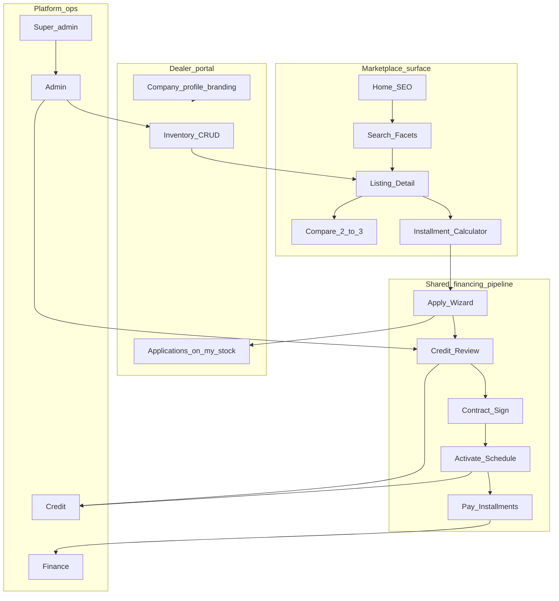

# DriveMarket — Documentation Pack (Source of Truth)

**Working title:** DriveMarket (rename freely here and cascade to brand tokens in `11_DESIGN_GUIDELINES.md`).  
**Pack version:** 1.1 (NestJS stack)  
**Market:** Qatar · Currency: QAR · UI language: English first (RTL/Arabic hooks required in design tokens)  
**Nature of work:** Greenfield. This folder is the single source of truth for scaffolding a new repository. No access to any Blox codebase is required to implement from these docs.

---

## Locked decisions

| Decision | Locked choice |
|----------|---------------|
| Business model | **Model C — Hybrid:** public marketplace listings + dealer portals (+ light white-label) + one shared financing pipeline |
| Stack | **NestJS + PostgreSQL + Prisma + Better Auth + S3/R2** + React/Vite monorepo apps + Flutter customer later. *(Supabase was an earlier draft; superseded.)* |
| State management | TanStack Query + Zustand (not Redux unless the implementing team explicitly prefers Blox parity) |
| Payments | SkipCash-style card redirect + webhook; bank transfer as operational path; QPay optional later |
| Blockchain | **Out of scope** for this product version (one-line future note only — see `10_RISKS_AND_OPEN_QUESTIONS.md`) |
| Credits / membership | Deferred post-MVP (explicit non-goal for Phases 0–5) |
| Customer one-loan rule | At most one in-flight **or** active financing application. Blocking set = all statuses except `rejected`, `submission_cancelled`, and `completed` |
| Listing search visibility | Search returns `published` only |
| Reserved listing detail | Applicant (owner) may see “pending financing”; other shoppers get 404 or sold-style unavailable message |
| On activate | Set `listing_status = sold` when application becomes `active` |
| Status enforcement | NestJS service-layer transitions (same matrices as former RPCs) — never trust UI-only transitions |
| Design | Mandatory: implement UI per `11_DESIGN_GUIDELINES.md` — do not improvise generic AI UI |

---

## What DriveMarket is

DriveMarket is a vehicle listing marketplace where customers discover cars from many dealers, compare options, calculate installments, and apply for financing on a listing—while dealers manage inventory in their own portal and platform credit/finance/admin staff run one shared underwriting and servicing pipeline.

It is **not** peer-to-peer lending and **not** a crypto product. The platform (or its licensed financing partner) underwrites; dealers supply inventory and fulfillment; customers get financed purchases.

---

## Glossary

| Term | Meaning |
|------|---------|
| **Listing / product** | A vehicle inventory row (`products`). Unit of discovery. Uses `listing_status`, not a single overloaded `status`. |
| **Application** | A financing request tied to one listing and one customer. Unit of underwriting. Uses `application_status`. |
| **Company** | Dealer (or platform inventory owner) tenant. Inventory and applications are scoped by `company_id`. |
| **Offer** | Financing terms template (rates, tenures, min down payment %). Snapshotted onto the application at submit. |
| **Blocking application** | An application whose status prevents the same customer from starting another (see domain model). |
| **Reserved listing** | `listing_status = reserved` — vehicle has an in-flight financing application; hidden from public search. |
| **Sold listing** | `listing_status = sold` — set when financing activates; vehicle is committed. |
| **Ops** | Credit, finance, admin, super-admin staff using internal portals. |
| **can_pay** | `companies.can_pay` gate — when false, customer cannot initiate gateway payments for that company’s deals. |
| **Pricing snapshot** | Immutable JSONB on the application capturing list price, down payment, tenor, rate, monthly at submit time. |
| **SECURITY DEFINER RPC** | Postgres function that runs with elevated privileges but must still check `auth.uid()` and role. |
| **White-label (light)** | Dealer portal may override logo + primary accent from `companies.branding`; DriveMarket chrome stays. |

---

## Document pack (reading order)

Read in this order before scaffolding. **Do not skip `11` before any UI work.**

| # | File | Purpose |
|---|------|---------|
| 00 | `00_README.md` | Locked decisions, glossary, how to build, what not to do |
| 01 | `01_PRODUCT_SPEC.md` | Vision, personas, principles, feature matrix, non-goals, metrics |
| 02 | `02_USER_JOURNEYS.md` | Primary journeys, mermaid, failure branches |
| 03 | `03_DOMAIN_MODEL.md` | Entities, columns, enums, status machines, RBAC, tenancy |
| 04 | `04_TECH_ARCHITECTURE.md` | Monorepo, stack, security, observability |
| 04A | `04A_NESTJS_STACK.md` | **Current locked backend:** NestJS + Prisma + Better Auth + S3/R2 |
| 05 | `05_API_RPC_CONTRACT.md` | Tables, RLS, RPCs, Edge Functions, webhooks, idempotency |
| 06 | `06_UI_IA_SCREENS.md` | Routes, screens, components, empty/error states (IA only) |
| 07 | `07_BUILD_PHASES.md` | Phases 0–5 backlog + acceptance criteria |
| 08 | `08_CURSOR_BOOTSTRAP.md` | Scaffold checklist + ordered Cursor prompts for empty repo |
| 09 | `09_ACCEPTANCE_TEST_MATRIX.md` | Manual/automated tests mapped to phases |
| 10 | `10_RISKS_AND_OPEN_QUESTIONS.md` | Risks, assumptions, deferred backlog, blockchain note |
| 11 | `11_DESIGN_GUIDELINES.md` | **Mandatory** design system — brand, tokens, motion, a11y, do/don't |

Cross-links: every implementation decision that touches status, roles, or payments must cite `03` + `05`. Every UI screen must cite composition rules in `11`.

---

## Apps and roles (quick map)

| Persona | App package | Auth role | Port (dev) |
|---------|-------------|-----------|------------|
| Shopper / borrower | `marketplace` | `customer` | 5173 |
| Dealer staff / principal | `dealer` | `dealer_agent` | 5176 |
| Credit officer | `credit` | `credit_officer` | 5177 |
| Finance officer | `finance` | `finance_officer` | 5179 |
| Platform ops admin | `admin` | `admin` | 5174 |
| Platform operator | `super-admin` | `super_admin` | 5175 |

Guest (unauthenticated): home, search, listing detail, calculator preview, help. Apply requires login + verified email.

---

## How to build (for another Cursor / team)

1. Open this entire `docs/drivemarket/` folder as project context in a **new empty repo**.
2. Follow `08_CURSOR_BOOTSTRAP.md` folder creation and workspace sketch.
3. Execute **Phase 0 only** per `07_BUILD_PHASES.md` + `04_TECH_ARCHITECTURE.md`, wiring tokens from `11_DESIGN_GUIDELINES.md`.
4. Run acceptance checks in `09_ACCEPTANCE_TEST_MATRIX.md` for Phase 0 before Phase 1.
5. Execute Phase 1 (marketplace MVP). Do **not** skip ahead to payments.
6. Continue phases sequentially. Every schema change requires a Supabase migration.
7. Before marking a phase done, tick the phase exit criteria in `07` and the mapped tests in `09`.

### Product principles (non-negotiable)

1. **Listing is the unit of discovery; application is the unit of financing.** Apply always starts from a published, finance-eligible listing.
2. **Postgres is system of record.** UI never invents authoritative state.
3. **Company tenancy everywhere.** Inventory and applications scoped to `company_id`; ops roles use all/assigned scopes.
4. **Secrets stay server-side.** SkipCash keys only in Edge Functions / Vault.
5. **Status transitions are server-enforced** (RPC + trigger).
6. **PII stays private.** QID, KYC docs, employment data: Storage + RLS; never public listing payloads.
7. **Marketplace honesty.** Reserved/sold vehicles must not look freely available to other shoppers.
8. **Marketplace-first IA.** Home and search beat “ops dashboard” for customers.

---

## What not to do

- Do **not** add blockchain, smart contracts, wallets, or on-chain escrow in Phases 0–5.
- Do **not** add Blox Credits, membership, or deferral products.
- Do **not** build multi-country / multi-currency support.
- Do **not** allow consumer-to-consumer private sellers (companies/dealers only).
- Do **not** rely on client-only blocking of second applications or client-only listing hide rules.
- Do **not** ship `SUPABASE_SERVICE_ROLE_KEY` (or any gateway secret) in Vite `VITE_*` env.
- Do **not** use a single overloaded `status` on products — use `listing_status`.
- Do **not** invent application statuses outside the enum in `03_DOMAIN_MODEL.md`.
- Do **not** let finance officers call activate (parity: only credit/admin activate).
- Do **not** improvise UI: no purple-on-white, no Inter/Roboto/Arial/system as primary fonts, no dashboard-looking marketing home. Follow `11_DESIGN_GUIDELINES.md`.
- Do **not** copy a Blox palette into DriveMarket; Blox docs are pattern reference only.

---

## Reference map (inspiration only — not required at build time)

If a Blox monorepo is available to the authoring team, these are pattern references only:

- Platform roles/statuses/payments narrative
- Flutter customer app spec structure (for Phase 5)
- Brand token *document format* (not palette)
- SkipCash Edge Function payment pattern

DriveMarket docs in this folder supersede any Blox behaviour where they conflict (especially listing reservation, blocking set including `active`, and marketplace-first IA).

---

## Success metrics (defined fully in product spec)

- Time-to-first-published-listing (dealer)
- Search → listing detail → apply start conversion
- Apply submit → under_review completion rate
- Activation cycle time (submit → active)
- On-time installment payment rate (post Phase 3)
- Dealer NPS / support ticket rate on inventory tools

---

## Ownership of this pack

When the product is renamed, update this file’s title, cascade brand name/tagline in `11_DESIGN_GUIDELINES.md`, and keep package scope name `@drivemarket/*` or rename consistently in `04` + `08`.
