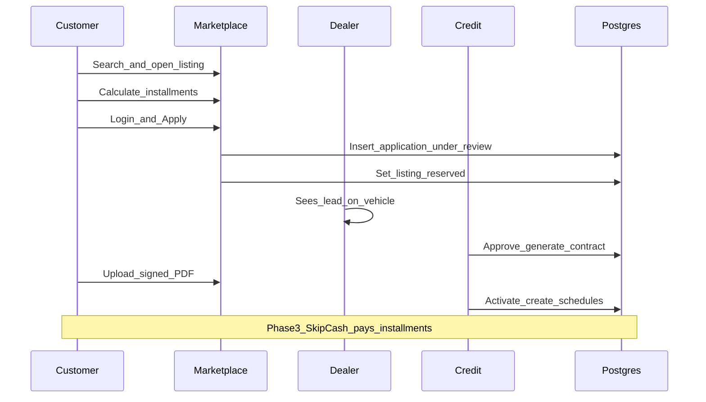
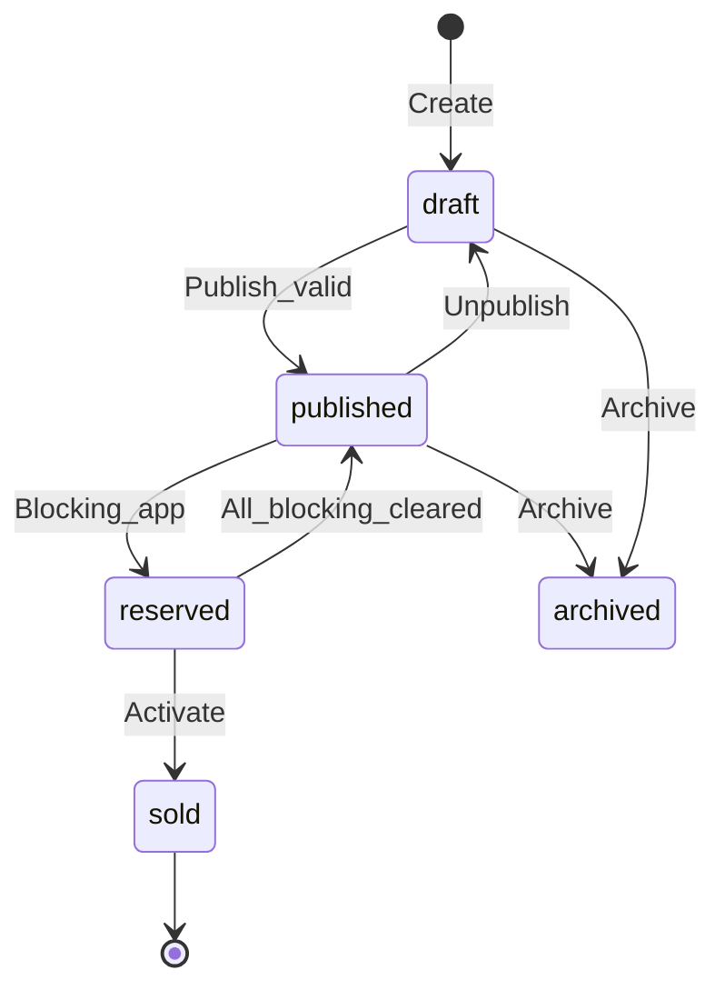
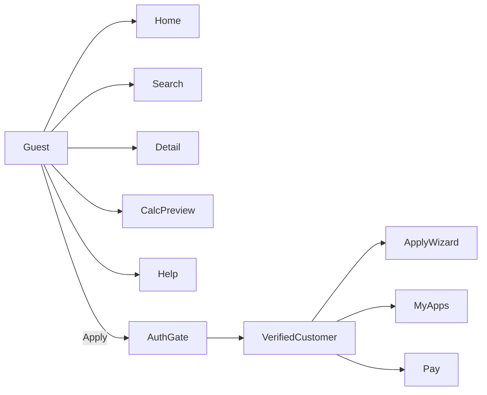

# 02 — User Journeys

**Product:** DriveMarket  
**Related:** [`01_PRODUCT_SPEC.md`](01_PRODUCT_SPEC.md) · [`03_DOMAIN_MODEL.md`](03_DOMAIN_MODEL.md) · [`05_API_RPC_CONTRACT.md`](05_API_RPC_CONTRACT.md) · [`06_UI_IA_SCREENS.md`](06_UI_IA_SCREENS.md)

Every journey below is implementable from RPCs and status rules in `03`/`05`. UI must not invent alternate paths.

---

## Journey index

| ID | Name | Primary actors | Phase |
|----|------|----------------|-------|
| J1 | Happy path — browse to active financing | Customer, Dealer, Credit | 1–2 (+ pay in 3) |
| J2 | Dealer publishes listing | Dealer, Admin | 1 |
| J3 | Customer blocked by existing application | Customer | 1 |
| J4 | Credit requests resubmission | Credit, Customer | 1–2 |
| J5 | Reject application + listing unreserve | Credit/Admin | 1–2 |
| J6 | Customer cancels submission | Customer | 1–2 |
| J7 | Direct-activate shortcut | Credit/Admin | 2 |
| J8 | Down-payment required path | Credit, Customer | 2–3 |
| J9 | Finance mark-paid vs SkipCash pay | Finance, Customer | 3–4 |
| J10 | Dealer unpublish while app in flight | Dealer | 1–2 |
| J11 | Payment webhook retry / idempotency | System, Customer | 3 |

---

## J1 — Happy path: browse to active financing

### Intent

Guest discovers a car, calculates installments, authenticates, applies with KYC docs, credit approves with contract, customer signs and uploads, credit activates schedules, customer pays (Phase 3).

### Sequence

### Numbered steps

1. **Guest lands on home** (`/`) — brand-forward hero per `11_DESIGN_GUIDELINES.md`; CTA to browse or search.
2. **Guest opens faceted search** (`/vehicles`) — filters: make, model year range, price range, condition, company (optional). Results are `listing_status = published` only via `list_published_products`.
3. **Guest opens listing detail** (`/vehicles/:slug`) — gallery, specs, price in QAR, finance eligibility badge, installment calculator.
4. **Guest runs calculator** — selects tenure / down payment within offer constraints; sees monthly estimate. No application created yet.
5. **Guest clicks Apply** — if unauthenticated → auth gate (`/auth/login` or signup) with return URL to apply wizard; if email unverified → blocking verify screen.
6. **Customer starts apply wizard** (`/app/applications/new?product=<slug>`) — server precheck: listing still `published` + `finance_eligible`; `has_blocking_application` = false.
7. **Customer completes form** — personal snapshot (name, phone, QID), employment/income fields, selected offer/tenure/down payment → client builds pricing preview (server re-validates on submit).
8. **Customer uploads KYC docs** — categories `qid`, `salary`, `bank`, `other` into Storage via `application_documents` (or upload RPC).
9. **Customer submits** — RPC `customer_create_application`:
   - Inserts application `status = under_review`
   - Snapshots pricing + customer JSONB
   - Sets product `listing_status = reserved` if was `published`
   - Writes activity_log + notification(s) to credit queue / dealer lead
10. **Dealer sees lead** on own stock (`/applications`) — read-only financing fields; cannot change status.
11. **Credit opens queue** — reviews docs, vehicle, pricing snapshot.
12. **Credit approves with contract** — RPC `credit_approve_with_contract` → `contract_signing_required`; contract PDF generated/stored; customer notified.
13. **Customer downloads contract, signs offline, uploads signed PDF** — RPC `customer_submit_signed_contract` → `contracts_submitted` (optionally auto or manual move to `contract_under_review` per ops config; default: `contracts_submitted` then credit moves to `contract_under_review`).
14. **Credit confirms contract** — transition to `pending_finance_activation` (or directly activate if policy allows from `contract_under_review`).
15. **Credit activates** — RPC `credit_activate_application` → `active`; creates `payment_schedules`; sets listing `sold`; notifies customer.
16. **Phase 3:** Customer pays installments via SkipCash; schedules move to `paid`; eventual `completed` when all schedules satisfied (ops or automatic rule).

### Failure branches (J1)

| Step | Failure | System behaviour |
|------|---------|------------------|
| 6 | Listing no longer published | Block apply; show unavailable |
| 6 | `has_blocking_application` | Redirect to existing application; explain one-loan rule |
| 6 | Not finance_eligible | Hide/disable Apply |
| 9 | Missing required docs | Validation error; stay on wizard |
| 9 | Race: second submit | RPC unique/blocking check; second fails cleanly |
| 12 | Credit rejects | See J5 |
| 12 | Needs more docs | See J4 |
| 13 | Bad file type / size | Reject upload; stay `contract_signing_required` |
| 15 | Activate twice | Idempotent no-op if already `active` |

---

## J2 — Dealer publishes listing

### Intent

Dealer creates inventory, uploads images, validates required fields, publishes to marketplace.

### Steps

1. Dealer logs into `dealer` app (role `dealer_agent`, `company_id` set).
2. Opens **Inventory** → **New**.
3. Enters required specs: make, model, model_year, condition, price (QAR), description; optional trim, engine, color, mileage, VIN (restricted read).
4. Uploads ≥1 image to `listing-images` bucket; rows in `product_images` with sort order.
5. Sets `finance_eligible` and optional `default_offer_id`.
6. Saves as `listing_status = draft`.
7. Clicks **Publish** — server validates: price > 0, make/model/year present, ≥1 image, company `status = active`. On success → `published`, set `published_at`.
8. Listing appears in public search within RLS/RPC constraints.

### Mermaid

### Failure branches

| Failure | Behaviour |
|---------|-----------|
| Missing required fields | Block publish; field-level errors |
| Zero images | Block publish |
| Company inactive | Block publish |
| Duplicate slug | Regenerate or reject with error |
| Unpublish while reserved | Forbidden or warn — see J10 |

---

## J3 — Customer blocked by existing application

### Intent

Enforce one in-flight or active financing application per customer.

### Steps

1. Customer with an application in any status **except** `rejected`, `submission_cancelled`, `completed` starts Apply on another listing.
2. Client may pre-call `has_blocking_application` for UX.
3. Server RPC `customer_create_application` **must** re-check and reject if blocking row exists.
4. UI shows existing application summary + link to `/app/applications/:id`.

### Blocking set (locked)

All statuses **except** `rejected`, `submission_cancelled`, `completed`.  
Includes `active` and `draft` if draft rows exist — prefer not leaving orphan drafts; wizard submit creates `under_review` directly. If drafts are persisted, treat `draft` as blocking.

---

## J4 — Credit requests resubmission

### Steps

1. Application is `under_review` (or `contract_under_review` for contract issues — use contract path separately).
2. Credit calls `ops_transition_application` with target `resubmission_required` + reason comment.
3. Customer notified; listing remains `reserved`.
4. Customer updates docs / fields on application detail.
5. Customer resubmits → transition to `under_review`.
6. Credit continues happy path or rejects.

### Failure branches

- Transition without reason → rejected by RPC.
- Customer tries to cancel while `resubmission_required` → allowed if cancel rules permit (see J6); unreserve if no other blockers.

---

## J5 — Reject application + listing unreserve

### Steps

1. Credit/Admin transitions application → `rejected` with reason.
2. Activity log + customer notification.
3. Server runs unreserve: if **no other** applications on that `product_id` are in blocking/in-flight set, set `listing_status = published` (if was `reserved`).
4. If another blocking app exists (rare; normally one app per listing reservation), keep `reserved`.

### Failure branches

- Reject from `active` — **not allowed**; use completion/settlement policies instead.
- Reject from `completed` — no-op / forbidden.

---

## J6 — Customer cancels submission

### Steps

1. Customer on `under_review` or `draft` chooses Cancel.
2. RPC `customer_cancel_application` → `submission_cancelled` (allowed sources: document in `03`; minimum `draft`, `under_review`; optionally early `resubmission_required` before contract).
3. Unreserve listing if no other blocking apps for product.
4. Customer may start a new application (cancelled is non-blocking).

### Failure branches

- Cancel after `contract_signing_required` — **forbidden** in MVP unless admin override; document as ops-only cancel.
- Cancel when `active` — forbidden.

---

## J7 — Direct-activate shortcut

### Intent

Policy flag for credit/admin to skip contract loop (e.g. paper contract already handled offline).

### Steps

1. Application in `under_review` (or allowed source statuses per policy).
2. Credit/Admin calls activate RPC with `direct_activate = true` **only if** company/platform setting `allow_direct_activate` is true.
3. Status → `active`; schedules created; listing → `sold`; contract fields may remain empty with audit note.

### Failure branches

- Flag false → RPC error.
- Finance officer attempts activate → denied.

---

## J8 — Down-payment required path

### Steps

1. After contract approval (or as credit decision), transition to `down_payment_required`.
2. Customer pays down payment (Phase 3 gateway) or uploads proof for ops confirmation → `down_payment_submitted`.
3. Credit/Finance confirms → `pending_finance_activation` or activate.
4. Listing remains `reserved` until activate → `sold`.

### Failure branches

- Pay without `can_pay` → blocked.
- Webhook duplicate → idempotent (J11).

---

## J9 — Finance mark-paid vs customer SkipCash pay

### SkipCash (customer)

1. Customer selects pending schedule → pay.
2. Edge `skipcash-payment` creates pending `payment_transactions`.
3. Redirect → return → `skipcash-verify`.
4. Webhook / verify calls `complete_skipcash_payment_atomic` → schedule `paid`, transaction `completed`.

### Finance mark-paid (ops)

1. Finance officer (scoped) marks schedule paid with method `bank_transfer` / `manual` + reference.
2. RPC updates schedule amounts/status; activity log.
3. Finance **cannot** activate applications.

### Failure branches

- Double pay same schedule → idempotency / remaining_amount checks.
- Mark paid on already paid → no-op or error.

---

## J10 — Dealer unpublish while application in flight

### Locked rule

If product has any application in blocking/in-flight set (not `rejected` / `submission_cancelled` / `completed`), **forbid** transition from `reserved`/`published` to `draft` or `archived` via dealer UI.

Admin override may archive with reason (audit required).

### Steps

1. Dealer clicks Unpublish on reserved listing.
2. RPC returns error `listing_has_active_financing`.
3. UI explains: resolve/reject application first or contact credit.

---

## J11 — Payment webhook retry / idempotency (Phase 3)

### Steps

1. SkipCash sends webhook (possibly multiple times).
2. Edge `skipcash-webhook` verifies signature, loads payment by gateway id.
3. Calls `complete_skipcash_payment_atomic` with idempotency key = gateway payment id.
4. First success: transaction `completed`, schedule updated.
5. Retries: detect already completed → return 200 success without double-applying amounts.

### Failure branches

| Case | Behaviour |
|------|-----------|
| Unknown payment id | Log + 404/ignore per gateway contract |
| Signature invalid | 401; do not mutate |
| Amount mismatch | Fail closed; alert via payment-monitor |
| Stuck `pending` | `payment-monitor` cron flags for ops |

---

## Guest vs authenticated surface summary

