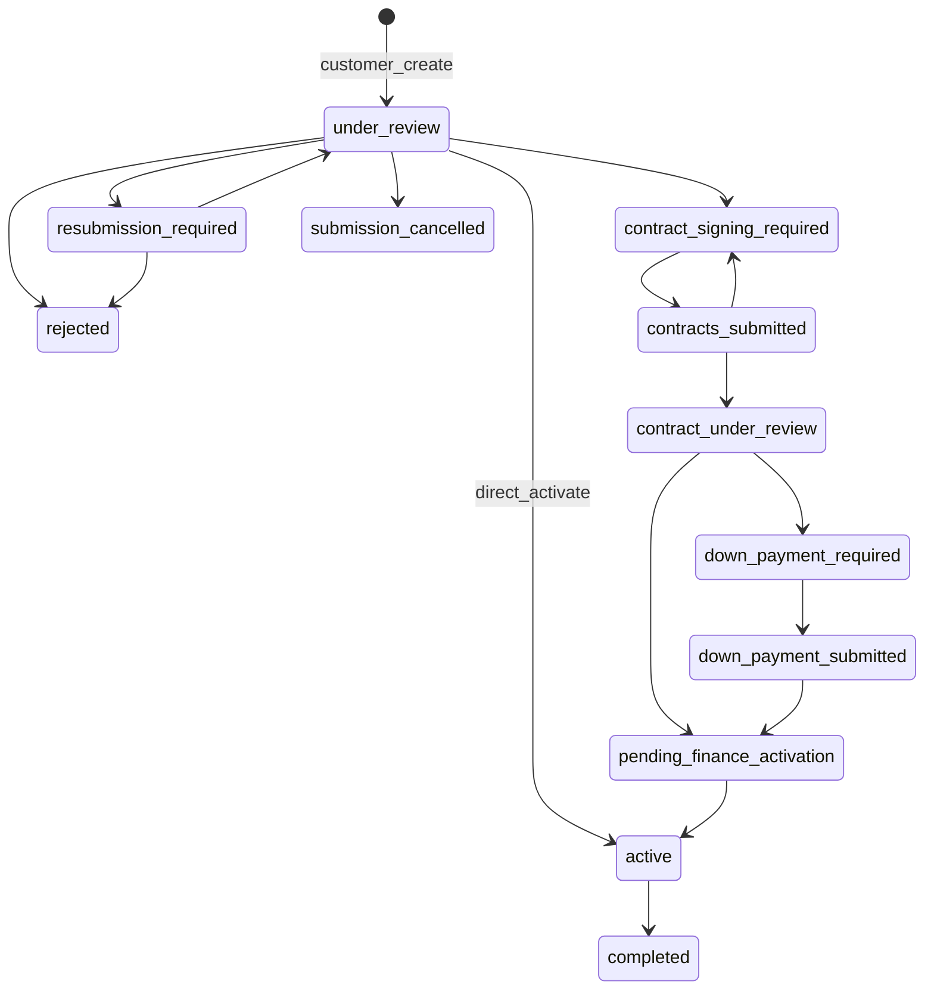

# 03 — Domain Model

**Product:** DriveMarket  
**Related:** [`05_API_RPC_CONTRACT.md`](05_API_RPC_CONTRACT.md) · [`02_USER_JOURNEYS.md`](02_USER_JOURNEYS.md) · [`01_PRODUCT_SPEC.md`](01_PRODUCT_SPEC.md)

This document is authoritative for enums, columns, transitions, RBAC, and tenancy. Migrations must match these names unless a rename is explicitly versioned here.

---

## 1. Tenancy rules

1. Every `products` row for marketplace dealers has `company_id NOT NULL`.
2. Every `applications` row stores `company_id` denormalized from the product at create time; **immutable after submit**.
3. `dealer_agent` users **must** have `company_id` set; they only see their company inventory and applications on their stock.
4. `credit_officer` / `finance_officer` use `credit_scope` / `finance_scope`:
   - `all` — all companies
   - `assigned` — only companies in `credit_officer_companies` / `finance_officer_companies`
5. `admin` / `super_admin` — cross-tenant; super_admin additionally manages roles and audit export.
6. `customer` — `company_id` null; sees only own applications and public listings.

---

## 2. Enums

### 2.1 `user_role`

```text
customer
dealer_agent
credit_officer
finance_officer
admin
super_admin
```

### 2.2 `company_status`

```text
active
inactive
```

### 2.3 `officer_scope`

```text
all
assigned
```

### 2.4 `listing_status` (on `products`)

```text
draft
published
reserved
sold
archived
```

**Search rule (locked):** public search returns `published` only.  
**Detail rule (locked):** for `reserved`, only the applicant with a blocking app on that product may view a “pending financing” detail; others get 404 or unavailable.  
**Activate rule (locked):** when application → `active`, set listing → `sold`.

### 2.5 `vehicle_condition`

```text
new
used
```

### 2.6 `offer_status`

```text
active
inactive
```

### 2.7 `application_status`

```text
draft
under_review
resubmission_required
contract_signing_required
contracts_submitted
contract_under_review
down_payment_required
down_payment_submitted
pending_finance_activation
active
completed
rejected
submission_cancelled
```

### 2.8 `document_category`

```text
qid
salary
bank
other
```

### 2.9 `schedule_status`

```text
pending
paid
overdue
waived
```

### 2.10 `payment_transaction_status`

```text
pending
completed
failed
```

### 2.11 `notification_channel` (optional)

```text
in_app
email
```

---

## 3. Entities and columns

Timestamps on all tables unless noted: `created_at timestamptz NOT NULL DEFAULT now()`, `updated_at timestamptz NOT NULL DEFAULT now()` (maintain via trigger).

### 3.1 `companies`

| Column | Type | Notes |
|--------|------|-------|
| id | uuid PK | `gen_random_uuid()` |
| name | text NOT NULL | |
| code | text UNIQUE | Short dealer code |
| status | company_status NOT NULL DEFAULT `active` | |
| can_pay | boolean NOT NULL DEFAULT false | Gate for customer gateway pay |
| logo_url | text | |
| branding | jsonb | `{ "primaryColor": "#…", … }` — see `11` white-label |
| contact_email | text | |
| contact_phone | text | |
| address | text | |
| allow_direct_activate | boolean NOT NULL DEFAULT false | Policy for J7 |
| created_at / updated_at | timestamptz | |

### 3.2 `users` (profile; PK = `auth.users.id`)

| Column | Type | Notes |
|--------|------|-------|
| id | uuid PK FK auth.users | |
| email | text NOT NULL | |
| role | user_role NOT NULL | |
| company_id | uuid NULL FK companies | Required when role = dealer_agent |
| credit_scope | officer_scope NOT NULL DEFAULT `assigned` | Meaningful for credit_officer |
| finance_scope | officer_scope NOT NULL DEFAULT `assigned` | Meaningful for finance_officer |
| full_name | text | |
| phone | text | |
| qid | text | Customer profile field; also snapshotted on apply |
| is_active | boolean NOT NULL DEFAULT true | |
| created_at / updated_at | timestamptz | |

Constraints:

- CHECK: `role != 'dealer_agent' OR company_id IS NOT NULL`

### 3.3 `credit_officer_companies` / `finance_officer_companies`

| Column | Type |
|--------|------|
| user_id | uuid FK users |
| company_id | uuid FK companies |
| created_at | timestamptz |

PK `(user_id, company_id)`.

### 3.4 `offers`

| Column | Type | Notes |
|--------|------|-------|
| id | uuid PK | |
| name | text NOT NULL | |
| annual_rent_rate | numeric | Or profit-rate field name; store as decimal |
| profit_rate | numeric NULL | Optional Islamic-style label field (not full engine) |
| tenure_options | jsonb NOT NULL | e.g. `[12,24,36,48,60]` |
| insurance_rate_id | uuid NULL | Optional FK if insurance table added later |
| is_default | boolean NOT NULL DEFAULT false | |
| status | offer_status NOT NULL DEFAULT `active` | |
| min_down_payment_pct | numeric NOT NULL DEFAULT 0 | 0–100 |
| company_id | uuid NULL | Null = platform-wide offer |
| created_at / updated_at | timestamptz | |

### 3.5 `products` (vehicle listings)

| Column | Type | Notes |
|--------|------|-------|
| id | uuid PK | |
| company_id | uuid NOT NULL FK companies | |
| slug | text NOT NULL UNIQUE | SEO |
| make | text NOT NULL | |
| model | text NOT NULL | |
| trim | text | |
| model_year | int NOT NULL | |
| condition | vehicle_condition NOT NULL | |
| engine | text | |
| color | text | |
| mileage | int | |
| vin | text | **Restricted read** — not in public select policies |
| chassis_number | text | Restricted read |
| description | text | |
| price | numeric(12,2) NOT NULL | QAR |
| finance_eligible | boolean NOT NULL DEFAULT true | |
| default_offer_id | uuid NULL FK offers | |
| listing_status | listing_status NOT NULL DEFAULT `draft` | |
| published_at | timestamptz | |
| featured_until | timestamptz | Phase 5 |
| created_at / updated_at | timestamptz | |

Indexes (minimum): `(listing_status, published_at DESC)`, `(make)`, `(model_year)`, `(price)`, `(company_id, listing_status)`, unique `(slug)`.

### 3.6 `product_images`

| Column | Type | Notes |
|--------|------|-------|
| id | uuid PK | |
| product_id | uuid NOT NULL FK products ON DELETE CASCADE | |
| storage_path | text NOT NULL | |
| sort_order | int NOT NULL DEFAULT 0 | |
| alt_text | text | |
| created_at | timestamptz | |

Prefer child table over `images text[]` for ordering and deletion.

### 3.7 `applications`

| Column | Type | Notes |
|--------|------|-------|
| id | uuid PK | |
| customer_user_id | uuid NOT NULL FK users | |
| customer_email | text NOT NULL | Denormalized |
| customer_snapshot | jsonb NOT NULL | name, phone, QID, employment, income |
| product_id | uuid NOT NULL FK products | |
| company_id | uuid NOT NULL FK companies | Immutable after insert |
| offer_id | uuid NOT NULL FK offers | |
| pricing_snapshot | jsonb NOT NULL | list_price, down_payment, tenor, rate, monthly |
| status | application_status NOT NULL | |
| installment_plan | jsonb | Schedule preview / plan metadata |
| contract_generated | boolean NOT NULL DEFAULT false | |
| contract_data | jsonb | Payload used to render PDF |
| contract_pdf_path | text | Generated unsigned |
| signed_contract_path | text | Customer upload |
| agent_user_id | uuid NULL | Optional dealer agent attribution |
| rejection_reason | text | |
| resubmission_comment | text | |
| status_reason | text | Last transition reason |
| created_at / updated_at | timestamptz | |
| submitted_at | timestamptz | |
| activated_at | timestamptz | |
| completed_at | timestamptz | |

### 3.8 `application_documents`

| Column | Type | Notes |
|--------|------|-------|
| id | uuid PK | |
| application_id | uuid NOT NULL FK applications ON DELETE CASCADE | |
| category | document_category NOT NULL | |
| storage_path | text NOT NULL | bucket `kyc-docs` |
| mime_type | text | |
| uploaded_by | uuid NOT NULL FK users | |
| created_at | timestamptz | |

### 3.9 `payment_schedules`

| Column | Type | Notes |
|--------|------|-------|
| id | uuid PK | |
| application_id | uuid NOT NULL FK applications | |
| sequence | int NOT NULL | 1..N |
| due_date | date NOT NULL | |
| amount | numeric(12,2) NOT NULL | |
| paid_amount | numeric(12,2) NOT NULL DEFAULT 0 | |
| remaining_amount | numeric(12,2) NOT NULL | |
| status | schedule_status NOT NULL DEFAULT `pending` | |
| payment_method | text | card, bank_transfer, manual, … |
| payment_reference | text | |
| paid_at | timestamptz | |
| created_at / updated_at | timestamptz | |

UNIQUE `(application_id, sequence)`.

### 3.10 `payment_transactions`

| Column | Type | Notes |
|--------|------|-------|
| id | uuid PK | |
| gateway | text NOT NULL DEFAULT `skipcash` | |
| gateway_payment_id | text | Unique when present |
| idempotency_key | text NOT NULL UNIQUE | Usually = gateway payment id |
| amount | numeric(12,2) NOT NULL | |
| currency | text NOT NULL DEFAULT `QAR` | |
| status | payment_transaction_status NOT NULL | |
| application_id | uuid NOT NULL FK applications | |
| schedule_id | uuid NULL FK payment_schedules | |
| raw_payload_ref | text | Storage path or log ref for webhook body |
| created_at / updated_at | timestamptz | |

### 3.11 `notifications`

| Column | Type | Notes |
|--------|------|-------|
| id | uuid PK | |
| user_id | uuid NOT NULL FK users | |
| title | text NOT NULL | |
| body | text | |
| link_path | text | In-app route |
| read_at | timestamptz | |
| channel | text DEFAULT `in_app` | |
| created_at | timestamptz | |

### 3.12 `activity_logs`

| Column | Type | Notes |
|--------|------|-------|
| id | uuid PK | |
| actor_user_id | uuid | Null = system |
| entity_type | text NOT NULL | application, product, payment, … |
| entity_id | uuid NOT NULL | |
| action | text NOT NULL | status_transition, publish, … |
| from_value | text | |
| to_value | text | |
| metadata | jsonb | |
| created_at | timestamptz | |

### 3.13 `email_outbox`

| Column | Type | Notes |
|--------|------|-------|
| id | uuid PK | |
| to_email | text NOT NULL | |
| subject | text NOT NULL | |
| body_html | text | |
| status | text NOT NULL DEFAULT `pending` | pending, sent, failed |
| attempts | int NOT NULL DEFAULT 0 | |
| last_error | text | |
| scheduled_at | timestamptz DEFAULT now() | |
| sent_at | timestamptz | |
| created_at | timestamptz | |

### 3.14 `device_tokens` (Flutter later)

| Column | Type | Notes |
|--------|------|-------|
| id | uuid PK | |
| user_id | uuid NOT NULL FK users | |
| token | text NOT NULL | |
| platform | text | ios, android |
| created_at / updated_at | timestamptz | |

---

## 4. Application status machine

### 4.1 Happy path (minimum)

```text
under_review
  → contract_signing_required
  → contracts_submitted
  → contract_under_review
  → pending_finance_activation
  → active
  → completed
```

### 4.2 Allowed transitions (server matrix)

| From | To | Who | Notes |
|------|----|-----|-------|
| *(new)* | under_review | customer via `customer_create_application` | Preferred create path |
| *(new)* | draft | customer (optional) | If drafts persisted; treat as blocking |
| draft | under_review | customer | Submit draft |
| draft | submission_cancelled | customer | |
| under_review | resubmission_required | credit, admin | Reason required |
| under_review | rejected | credit, admin | Reason required; unreserve |
| under_review | contract_signing_required | credit, admin | Via approve+contract RPC |
| under_review | active | credit, admin | Direct activate if policy |
| under_review | submission_cancelled | customer | |
| resubmission_required | under_review | customer | After updates |
| resubmission_required | rejected | credit, admin | |
| resubmission_required | submission_cancelled | customer | Allowed in MVP |
| contract_signing_required | contracts_submitted | customer | Signed PDF uploaded |
| contract_signing_required | rejected | credit, admin | |
| contracts_submitted | contract_under_review | credit, admin | |
| contracts_submitted | contract_signing_required | credit, admin | Bad signature; resubmit |
| contracts_submitted | rejected | credit, admin | |
| contract_under_review | pending_finance_activation | credit, admin | |
| contract_under_review | down_payment_required | credit, admin | Optional path |
| contract_under_review | contract_signing_required | credit, admin | |
| contract_under_review | rejected | credit, admin | |
| down_payment_required | down_payment_submitted | customer / system | Pay or proof |
| down_payment_submitted | pending_finance_activation | credit, finance, admin | Confirm DP |
| down_payment_submitted | down_payment_required | credit, admin | Reject proof |
| pending_finance_activation | active | credit, admin | Activate RPC only |
| active | completed | credit, finance, admin | All paid / settled |
| * | * (not listed) | — | **Forbidden** |

**Finance officer** may transition payment-related confirmation (`down_payment_submitted` → `pending_finance_activation`) and mark schedules paid, but **must not** call activate (`→ active`).

### 4.3 Mermaid



---

## 5. Blocking application rule (locked)

A customer may have **at most one** in-flight or active financing application.

**Non-blocking (may start a new apply):**

- `rejected`
- `submission_cancelled`
- `completed`

**Blocking:** every other `application_status`, including `active` and `draft`.

Server enforcement: `has_blocking_application(user_id)` and inside `customer_create_application`.

---

## 6. Listing reservation rules (locked)

| Event | Listing effect |
|-------|----------------|
| Application enters any blocking/in-flight status (not rejected/cancelled) and product is `published` | Set `reserved` |
| Application → `rejected` or `submission_cancelled` and **no other** blocking apps for `product_id` | Revert `reserved` → `published` |
| Application → `active` | Set `sold` |
| Dealer unpublish while reserved / blocking apps exist | **Forbidden** (admin override with audit only) |

“Blocking apps for product” = applications on that product whose status is not in `{rejected, submission_cancelled, completed}`.

---

## 7. RBAC matrix

| Capability | customer | dealer_agent | credit_officer | finance_officer | admin | super_admin |
|------------|----------|--------------|----------------|-----------------|-------|-------------|
| Public browse published listings | Y | Y | Y | Y | Y | Y |
| Apply / manage own applications | Y | — | — | — | — | — |
| Pay own schedules (if can_pay) | Y | — | — | — | — | — |
| CRUD own company products | — | Y | — | — | Y | Y |
| See apps on own stock (limited fields) | — | Y | — | — | Y | Y |
| See apps by credit scope | — | — | Y | — | Y | Y |
| See apps by finance scope | — | — | — | Y | Y | Y |
| Transition to contract / activate | — | — | Y | — | Y | Y |
| Mark paid / settlements | — | — | — | Y | Y | Y |
| Manage companies / offers / users | — | — | — | — | Y | Y |
| Assign super_admin / audit export | — | — | — | — | — | Y |
| Change application financing status (dealer) | — | — | — | — | — | — |

Dealers **cannot** change application financing status (optional “confirm delivery” is post-MVP).

---

## 8. PII and public payload rules

**Never** include in public listing RPC/select:

- `vin`, `chassis_number` (ops/dealer/credit only)
- Customer QID, employment, income
- Document storage paths for KYC/contracts
- Payment gateway payloads

Public product payload: identity + specs (non-VIN) + price + images + listing_status (published only in search) + finance_eligible + company display name/logo.

---

## 9. Money and numeric conventions

- Currency: QAR, `numeric(12,2)` for money columns.
- Rates: store as decimal fractions or percent consistently — **lock: percent numbers** (e.g. `12.5` means 12.5% per year) and document in calculator helpers.
- Display: tabular numeric font per `11_DESIGN_GUIDELINES.md`.
