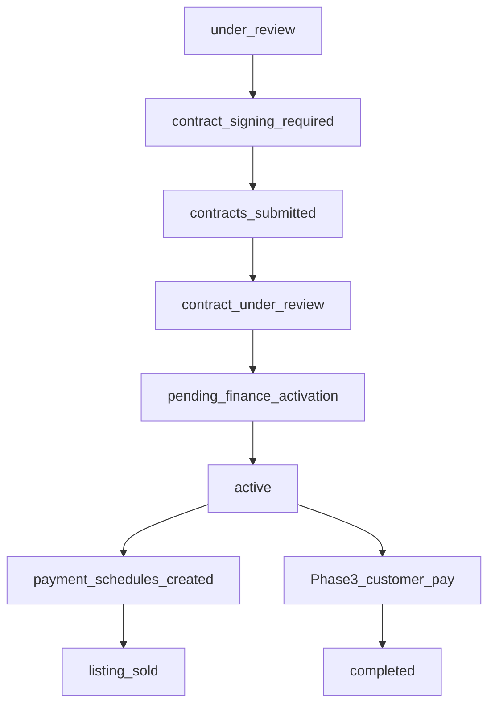

# 12 — Full Platform Gap Analysis & Roadmap

**Product:** DriveMarket (Blox marketplace monorepo)  
**Date:** 2026-08-07  
**Scope bar:** Full platform vision (Phases 0–5 + mature ops maturity)  
**Personas:** Customer, Dealer, Admin, Credit, Finance (+ Super-admin companion)  
**Related:** [`01_PRODUCT_SPEC.md`](01_PRODUCT_SPEC.md) · [`02_USER_JOURNEYS.md`](02_USER_JOURNEYS.md) · [`07_BUILD_PHASES.md`](07_BUILD_PHASES.md) · [`09_ACCEPTANCE_TEST_MATRIX.md`](09_ACCEPTANCE_TEST_MATRIX.md) · [`10_RISKS_AND_OPEN_QUESTIONS.md`](10_RISKS_AND_OPEN_QUESTIONS.md)

This document is the **brainstorm deliverable**: inventory of what exists vs what is needed, day-in-the-life job stories, edge journeys, parked business decisions, frozen non-goals, and a MoSCoW roadmap. It does not replace the authoritative specs in docs 01–11.

---

## Executive summary

| Area | Today | Full platform needs |
|------|-------|---------------------|
| **Customer** | Browse → apply → watch status | + KYC UI, resubmit/cancel, contract, pay, notifications |
| **Dealer** | Inventory, publish, quotes, lead list | + unpublish UI, offer/eligibility, lead detail, guardrails, reporting |
| **Admin** | Auth shell + mock pages | Wire companies, users, offers, ops queue, settings, real KPIs |
| **Credit** | Queue, reject, resubmit | **Approve → contract → activate** (broken spine) |
| **Finance** | Mock UI | Schedules domain, mark-paid, overdue, reconciliation |
| **Platform** | Partial auth hardening, activity writes | Full status machine, payments, scopes, audit read, analytics |

**Critical finding:** The financing spine stops at `under_review`. Everything after is schema/copy only. No path to `active`, no `payment_schedules`, no customer pay flow.

---

## 1. P0 spine gap inventory (financing happy path)

Spec reference: J1 in [`02_USER_JOURNEYS.md`](02_USER_JOURNEYS.md); acceptance P2-01–P2-14 in [`09`](09_ACCEPTANCE_TEST_MATRIX.md).

### 1.1 Intended spine (locked)

Optional branches (also missing): `down_payment_required` → `down_payment_submitted`; J7 direct-activate shortcut.

### 1.2 Step-by-step gap table

| Step | Spec status | As-built | Gap severity | Required capability |
|------|-------------|----------|--------------|-------------------|
| Customer applies + KYC | P1-09 | Apply works; **no doc upload UI** | P1 | Wizard doc upload; required-doc validation before submit |
| Listing → `reserved` | P1-10 | **Have** (atomic update) | — | — |
| Credit queue + review | P1-13 | **Have** | — | KYC doc viewer in credit UI |
| Credit **approve + contract** | P2-01 | **Missing** — no transition, no PDF | **P0** | `credit_approve_with_contract`; contract PDF generate/store; notify customer |
| Customer download/sign/upload | P2-02 | **Missing** — no UI/API | **P0** | Customer contract download; signed PDF upload → `contracts_submitted` |
| Credit contract review | P2-03 | **Missing** | **P0** | Transition to `contract_under_review` → `pending_finance_activation` |
| Credit **activate** | P2-04 | **Missing** | **P0** | `credit_activate_application`; create `payment_schedules`; listing → `sold`; `activatedAt` |
| Finance cannot activate | P2-06 | Not enforced (no activate) | P1 | Guard on activate RPC |
| Direct activate (policy) | P2-07/08 | **Missing** | P2 | `allow_direct_activate` on company; audit note |
| Customer sees schedule | Phase 2/3 | **Missing** | P1 | Read-only schedule on application detail |
| Customer pays installment | P3-02 | **Missing** | P1 | SkipCash create/verify/webhook; schedule → `paid` |
| Finance mark paid | P3-06 | **Missing** | P1 | Ops mark paid with reference |
| Application → `completed` | Spec | **Missing** | P2 | Rule when all schedules satisfied |

### 1.3 Domain models missing from schema (vs spec `03`)

| Model / field set | In Prisma today? | Needed for spine |
|-------------------|------------------|------------------|
| `payment_schedules` | **No** | Activate |
| `payment_transactions` | **No** | Pay + webhook |
| `notifications` (readable) | Partial writes | Customer/ops inbox |
| `activity_logs` (readable) | Writes only | Super-admin audit |
| `credit_officer_companies` / `finance_officer_companies` | **No** | Phase 4 scopes |
| `email_outbox` | **No** | Reliable email |
| Contract fields on `Application` | Yes (unused) | Approve/activate path |

### 1.4 API / transition gaps (vs `applications.service.ts`)

| Transition | Implemented? |
|------------|--------------|
| → `under_review` (create) | Yes |
| `under_review` → `rejected` \| `resubmission_required` | Yes |
| `resubmission_required` → `under_review` \| `rejected` | Yes |
| → `submission_cancelled` | Yes |
| → `contract_signing_required` | **No** |
| → `contracts_submitted` | **No** |
| → `contract_under_review` | **No** |
| → `down_payment_*` | **No** |
| → `pending_finance_activation` | **No** |
| → `active` | **No** |
| → `completed` | **No** |

### 1.5 P0 spine backlog (ordered)

1. Expand transition service + tests for full matrix (P2-12, P2-14).
2. Contract PDF generation + storage (`S3_BUCKET_CONTRACTS`).
3. Credit UI: Approve with contract action.
4. Customer UI: contract download + signed upload.
5. Credit UI: contract review + activate.
6. `PaymentSchedule` model + generation on activate.
7. Listing → `sold` on activate; reservation sync tests (P2-04, R1).
8. Customer application detail: schedule read-only view.
9. Phase 3: SkipCash + mark-paid (separate epic, blocked until 1–8 green).

---

## 2. Persona day-in-the-life deep dives

Each section: **job story → touchpoints → have / partial / missing**.

### 2.1 Customer — guest to completed loan

| # | Moment | Job story | Touchpoints | Status |
|---|--------|-----------|-------------|--------|
| C1 | Discovery | “I find the right car in QAR without visiting five dealer sites” | Home, `/vehicles`, facets, cards | **Partial** — no featured home hero per spec; browse works |
| C2 | Research | “I compare two cars and understand monthly cost” | Detail calculator, compare | **Partial** — compare local-only; calculator works |
| C3 | Trust | “I know this dealer and listing is legit” | Dealer directory, showroom, badges | **Have** |
| C4 | Intent | “I can try installments before signing up” | Guest calculator on detail | **Have** |
| C5 | Gate | “I sign in once and come back to my application” | Login/register, returnUrl | **Partial** — email verify **off** (P1-08 fails) |
| C6 | Apply | “I submit everything you need in one go” | Apply wizard, KYC upload, pricing | **Partial** — no doc upload UI; no required-doc gate |
| C7 | Special deal | “My dealer’s email quote price is honored” | `/quotes/:token` | **Have** |
| C8 | Wait | “I know where my application stands” | Dashboard, detail, timeline | **Partial** — timeline truncates; no next-action CTAs |
| C9 | Fix | “You asked for more docs — I can fix and resubmit” | Resubmit flow | **Missing UI** (API exists) |
| C10 | Exit | “I changed my mind before approval” | Cancel | **Missing UI** (API exists) |
| C11 | Contract | “I get the contract, sign, upload” | Download PDF, upload signed | **Missing** |
| C12 | Pay down | “I pay down payment if required” | Down payment path J8 | **Missing** |
| C13 | Active | “I see my payment schedule” | Schedule list | **Missing** |
| C14 | Pay | “I pay monthly online” | SkipCash redirect, receipt | **Missing** |
| C15 | Done | “I know when the loan is fully paid” | `completed` status | **Missing** |
| C16 | Stay informed | “I get notified at each step” | Bell/inbox, email | **Missing** customer surface |
| C17 | Return | “I save cars for later” | Favorites | **Missing** (Phase 5) |
| C18 | Language | “I use Arabic” | RTL, AR copy | **Missing** (deferred in spec) |

**Customer complete when:** C5–C16 are **Have** for MVP launch; C17–C18 for full platform polish.

---

### 2.2 Dealer — invite to sold vehicle

| # | Moment | Job story | Touchpoints | Status |
|---|--------|-----------|-------------|--------|
| D1 | Onboard | “Admin invites us; we log in same day” | Admin creates company+user | **Partial** — API exists; admin UI mock |
| D2 | Stock in | “I add cars with photos and specs” | Inventory CRUD, images | **Have** |
| D3 | Finance-ready | “I mark eligible cars and tie them to an offer” | finance_eligible, default_offer | **Missing** in dealer form |
| D4 | Go live | “I publish when ready” | Publish | **Have** |
| D5 | Control | “I unpublish sold or stale listings” | Unpublish | **Partial** — API only |
| D6 | Promote | “I send a special price to a serious buyer” | Dealer quotes | **Have** |
| D7 | Leads | “I see who applied on my stock” | Applications list | **Partial** — list only |
| D8 | Follow up | “I open a lead and know what to do” | Lead detail, customer contact | **Missing** |
| D9 | Safety | “I can’t break an in-flight deal by unpublishing” | J10 guard | **Missing** |
| D10 | Brand | “Our logo shows on our portal” | Company profile/branding | **Partial** — read-only |
| D11 | Team | “I invite my sales staff” | Dealer user management | **Missing** (Phase 4+) |
| D12 | Performance | “I see conversion and aging inventory” | Reports | **Missing** |

**Dealer complete when:** D1, D3, D5, D7–D9 are **Have** for ops-complete; D10–D12 for full platform.

---

### 2.3 Admin — platform operations

| # | Moment | Job story | Touchpoints | Status |
|---|--------|-----------|-------------|--------|
| A1 | Onboard dealer | “New dealer live in <1 business day” | Create company, invite user | **Missing UI** |
| A2 | Catalog | “I manage financing offers/packages” | Offers CRUD | **Missing** |
| A3 | Oversight | “I see all applications and intervene” | Ops queue | **Missing UI** (API exists) |
| A4 | Override | “I fix a stuck listing or application” | Admin transitions, archive | **Missing** |
| A5 | Users | “I invite credit/finance/dealer users” | User admin | **Missing UI** |
| A6 | Payments policy | “I enable pay when SkipCash is ready” | `companies.can_pay` | **Missing** |
| A7 | Health | “I see KPIs: apply rate, activation time” | Dashboard | **Mock** |
| A8 | Money | “I reconcile platform ledgers” | Ledgers/settlements | **Missing** |

**Admin complete when:** A1–A6 **Have** for ops-complete; A7–A8 for full platform.

---

### 2.4 Credit — queue to activate

| # | Moment | Job story | Touchpoints | Status |
|---|--------|-----------|-------------|--------|
| Cr1 | Triage | “I see new apps in my queue” | Ops queue | **Have** |
| Cr2 | Review | “I open app, see customer, vehicle, pricing, docs” | Detail + doc viewer | **Partial** — weak/no doc viewer |
| Cr3 | Decide reject | “I reject with reason” | Reject transition | **Have** |
| Cr4 | Decide more info | “I request resubmission” | Resubmission | **Have** |
| Cr5 | Approve | “I approve and send contract” | Approve + PDF | **Missing** |
| Cr6 | Contract QC | “I review signed PDF” | Contract review transition | **Missing** |
| Cr7 | Activate | “I activate financing and schedules generate” | Activate | **Missing** |
| Cr8 | Shortcut | “Paper contract already done — direct activate” | J7 policy flag | **Missing** |
| Cr9 | Scope | “I only see my assigned dealers” | Officer-company M2M | **Missing** |
| Cr10 | Audit | “Every decision is logged” | Activity log read | **Partial** — writes only |

**Credit complete when:** Cr1–Cr7 **Have** (spine); Cr8–Cr10 for full platform.

---

### 2.5 Finance — servicing

| # | Moment | Job story | Touchpoints | Status |
|---|--------|-----------|-------------|--------|
| F1 | Portfolio | “I see active loans and schedules” | Schedule list by app | **Missing** (mock) |
| F2 | Confirm transfer | “Customer paid by bank — I mark it” | Mark paid RPC | **Missing** |
| F3 | Boundaries | “I cannot activate loans” | RBAC | **Not testable** until activate exists |
| F4 | Overdue | “I see who is late” | Overdue flag/filter | **Missing** |
| F5 | Reconcile | “I export today’s payments” | Export | **Missing** |
| F6 | Scope | “I only see assigned dealers” | Officer-company M2M | **Missing** |
| F7 | Down payment | “I confirm down payment proof” | J8 ops confirm | **Missing** |

**Finance complete when:** F1–F4 **Have** for ops-complete; F5–F7 for full platform.

---

## 3. Edge journeys (J3–J11) — gaps

| Journey | Intent | As-built | Missing capabilities |
|---------|--------|----------|----------------------|
| **J3** Block second app | One loan rule | **Have** (server) | Client UX precheck already partial; ensure `active` in blocking set |
| **J4** Resubmission | Credit asks docs; customer resubmits | **Partial** | Credit **Have**; customer resubmit **API only**; doc re-upload UI; notify customer |
| **J5** Reject + unreserve | Listing back to published | **Have** | — |
| **J6** Customer cancel | Withdraw before contract | **Partial** | Cancel **API only**; forbid cancel after `contract_signing_required` (P2-10) |
| **J7** Direct activate | Skip contract loop | **Missing** | `allow_direct_activate`; activate RPC branch; audit |
| **J8** Down payment path | Pay before activate | **Missing** | Status transitions; customer pay or proof upload; finance/credit confirm |
| **J9** Mark paid vs SkipCash | Dual payment rails | **Missing** | Full Phase 3 + finance mark-paid UI |
| **J10** Dealer unpublish blocked | Protect in-flight deal | **Missing** | Server forbid + dealer UI error `listing_has_active_financing` |
| **J11** Webhook idempotency | No double pay | **Missing** | `payment_transactions`; idempotency key; monitor cron |

### Edge journey acceptance mapping

| Test IDs | Journey | Pass today? |
|----------|---------|-------------|
| P1-11 | J3 | Likely **Pass** |
| P1-14, P1-15 | J5, J4 | **Pass** (credit side) |
| P2-09, P2-10 | J6 | **Partial** (API, no UI; post-contract rule untested) |
| P2-07, P2-08 | J7 | **Fail** |
| P2-11 | J10 | **Fail** |
| P3-03, P3-05 | J11 | **Fail** |

---

## 4. Open business questions — resolved or parked

Decisions below use **spec defaults** from [`10_RISKS_AND_OPEN_QUESTIONS.md`](10_RISKS_AND_OPEN_QUESTIONS.md) unless noted. Parked items need product-owner sign-off before production contracts/payments.

| ID | Question | **Parked decision (build against this)** | Sign-off needed? |
|----|----------|------------------------------------------|------------------|
| Q1 | Lender of record on PDF | Platform placeholder + `contract_data.partner_name` field; template versioned | **Yes** — legal before prod |
| Q2 | Insurance in calculator | Optional line; `insurance_rate_id` nullable | No |
| Q3 | `completed` frees listing? | **No** — stays `sold`; new inventory row for resale | No |
| Q4 | SkipCash field names | Adapter module; sandbox-first | **Yes** — when integrating |
| Q5 | KYC retention | No auto-delete in MVP; compliance policy TBD | **Yes** — compliance |
| Q6 | Dealer sees full QID | **MVP: yes** for lead fulfillment; mask in Phase 4 if compliance requires | **Yes** — compliance |
| Q7 | Auto `contracts_submitted` → `contract_under_review` | **Manual** credit move (default) | No |
| Q8 | Featured listings commercial | Phase 5 `featured_until` only | No |
| Q9 | QPay vs SkipCash | **SkipCash first**; QPay optional later | No |
| Q10 | Multi-offer per listing | **One offer** at apply (product default); no offer shopping | No |

### Additional questions from brainstorm — parked

| Question | Parked decision |
|----------|-----------------|
| Down payment mandatory before activate? | **Optional path** — statuses exist; enable per credit decision (J8), not blocking MVP spine |
| Finance sees apps before `active`? | **Read-only** scoped queue for `pending_finance_activation` / down payment confirm; primary job is schedules post-activate |
| Email verification before apply? | **Required for production** (P1-08); currently off — treat as **Must** before launch |
| Collections depth | **MVP full platform:** overdue flag + in-app reminder; **not** dunning/legal workflow |
| Flutter in full platform? | **Yes, Phase 5** — customer parity per spec; web-first until Phase 2 spine green |

---

## 5. Frozen non-goals (backlog boundary)

These stay **out of scope** even for “full platform” unless explicitly reopened by product owner:

| Category | Non-goal |
|----------|----------|
| Settlement | Blockchain, wallets, on-chain escrow, smart contracts |
| Product | C2C private sellers; multi-country; multi-currency |
| Underwriting | AI as sole decision maker; full Sharia/islamic finance engine |
| Loyalty | Credits, membership, deferrals |
| Comms | Full dealer↔customer chat; native dealer mobile apps |
| Collections | Advanced legal/collections workflow beyond overdue flag + reminders |
| Payments | QPay as Phase 0–3 requirement |
| RBAC | Full dealer sub-role matrix before Phase 4 principal flags |

**In scope for full platform:** Phases 0–5 per [`07_BUILD_PHASES.md`](07_BUILD_PHASES.md), officer scopes, SkipCash, mark-paid, compare/favorites/featured/SEO, soft white-label, Flutter customer app, light ops notes, reporting KPIs, Arabic/RTL.

---

## 6. MoSCoW roadmap (phased)

Priorities assume spine-first release philosophy from spec §11.

### Must have (launch blockers — Phases 1–2 completion)

| ID | Item | Personas |
|----|------|----------|
| M1 | KYC upload in apply wizard + credit doc viewer | Customer, Credit |
| M2 | Email verification gate before apply | Customer |
| M3 | Approve → contract PDF → customer sign/upload | Credit, Customer |
| M4 | Contract review + activate + schedules + `sold` | Credit |
| M5 | Full transition matrix + listing sync tests | Platform |
| M6 | Customer resubmit/cancel UI | Customer |
| M7 | Customer notifications inbox (in-app) | Customer |
| M8 | Admin: create company + dealer user (wire UI) | Admin, Dealer |
| M9 | Dealer: unpublish UI + J10 guard | Dealer |
| M10 | Dealer: finance_eligible + default offer on listing | Dealer |
| M11 | Credit queue scoped filters (company, status) | Credit |
| M12 | Wire admin/credit/finance to real APIs (remove mock data) | Admin, Credit, Finance |

### Should have (ops-complete — Phase 3–4)

| ID | Item |
|----|------|
| S1 | SkipCash pay + webhook idempotency |
| S2 | Finance mark-paid (bank transfer) |
| S3 | Finance real schedule list + overdue filter |
| S4 | Admin offers CRUD |
| S5 | Officer company scope M2M + enforcement |
| S6 | Activity log list API + super-admin export |
| S7 | Email outbox reliability |
| S8 | Dealer lead detail page |
| S9 | Down payment path (J8) if business enables |
| S10 | Direct activate policy (J7) |
| S11 | Admin dashboard real KPIs |
| S12 | Payment reminders cron |

### Could have (full platform polish — Phase 5 + maturity)

| ID | Item |
|----|------|
| C1 | Compare/favorites/featured/SEO |
| C2 | Soft white-label dealer branding |
| C3 | Flutter customer app |
| C4 | Arabic + RTL |
| C5 | Dealer reporting (conversion, aging) |
| C6 | Admin ledgers/settlements view |
| C7 | Dealer user invite |
| C8 | Dealer/application ops notes |
| C9 | Analytics event pipeline |
| C10 | Settlement discount settings |

### Won't have (this program)

See §5 non-goals.

---

## 7. Implementation phase map (aligned to `07`)

| Phase | Focus | Exit when |
|-------|-------|-----------|
| **1b** (finish Phase 1) | KYC UI, email verify, resubmit/cancel UI, admin dealer onboarding UI, dealer listing controls | P1-08, P1-09, P1-19 pass |
| **2** | Contract + activate + schedules | P2-01–P2-14 pass |
| **3** | SkipCash + mark-paid | P3-01–P3-09 pass |
| **4** | Scopes, finance parity, email, notes | P4-01–P4-06 pass |
| **5** | Marketplace polish + Flutter | P5-01–P5-xx pass |

---

## 8. Gap summary scorecard

| Persona | Have | Partial | Missing | Ops-complete blockers |
|---------|------|---------|---------|------------------------|
| Customer | 4 | 8 | 8 | M1–M7 |
| Dealer | 4 | 4 | 6 | M8–M10 |
| Admin | 1 | 0 | 8 | M8, M12, S4 |
| Credit | 3 | 2 | 5 | M3–M5, M11 |
| Finance | 1 | 0 | 6 | M12, S2–S3 |
| Platform | 2 | 4 | 9 | M5, S1–S7 |

---

## 9. Brainstorm completion checklist

- [x] P0 spine gaps enumerated with ordered backlog
- [x] Day-in-the-life for all five personas
- [x] Edge journeys J3–J11 mapped to gaps
- [x] Open questions parked with defaults
- [x] Non-goals frozen
- [x] MoSCoW + phase roadmap produced

**Next action (implementation):** Start **Phase 1b + Phase 2 spine** (M1–M5) before any payment gateway work, per release philosophy in [`01_PRODUCT_SPEC.md`](01_PRODUCT_SPEC.md) §11.

---

*Generated from as-built audit of `packages/*` and canonical docs 01–11. Update this file when major capabilities ship.*
