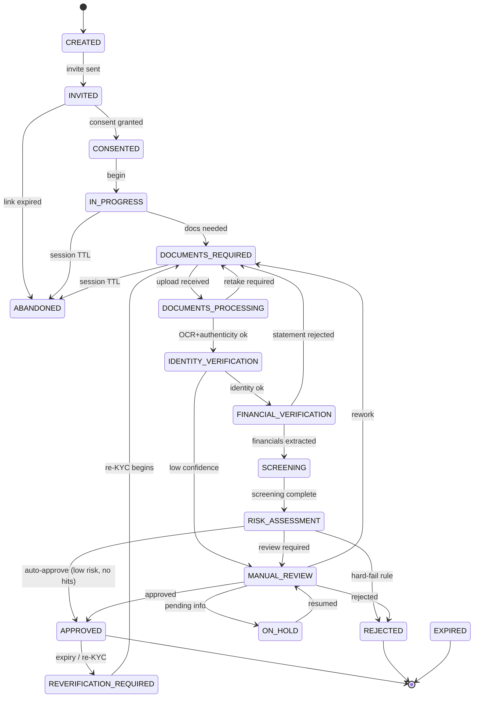
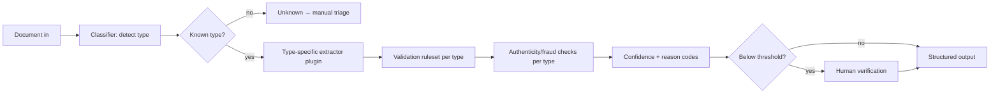
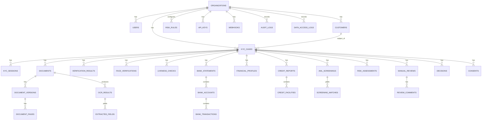
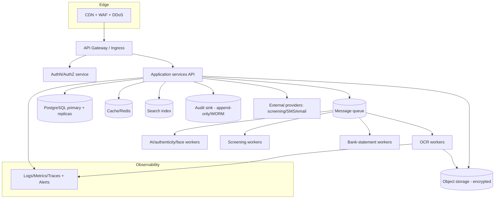
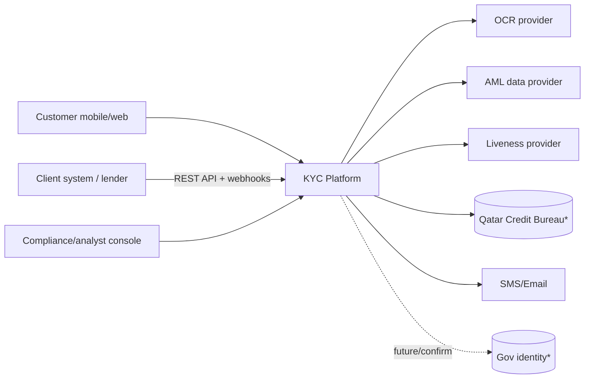

# Software Requirements Specification & Technical Implementation Blueprint
## Enterprise KYC / Customer Due Diligence / Document Intelligence Platform — Qatar (Initial Jurisdiction)

**Document status:** Draft v1.0 — implementation-ready baseline
**Date:** 20 August 2026
**Classification:** Confidential
**Owning roles:** Solution Architecture · Product · Compliance (KYC/AML) · Security · Data · QA · Delivery

---

### How to read this document
- Every requirement carries a unique ID: `BR-` business, `FR-` functional, `NFR-` non-functional, `SEC-` security, `DATA-` data, `API-` API, `UX-` UX, `QA-` quality, `REG-` regulatory, `INT-` integration.
- Regulatory/vendor uncertainty is marked inline as **`ASSUMPTION`**, **`OPEN QUESTION`**, **`REQUIRES REGULATORY CONFIRMATION`**, or **`REQUIRES THIRD-PARTY INTEGRATION CONFIRMATION`**. These are not decorative — they are gates that must be closed by named owners before the dependent work starts (see Part 43).
- Nothing in this document asserts that a Qatari government body exposes a public API to private businesses unless it is explicitly confirmed. As of this writing, **no such general-purpose government identity-verification API for private KYC is confirmed** (see REG-007).

---

## Regulatory grounding (verified facts vs. open items)

| Ref | Fact | Source status |
|---|---|---|
| Qatar AML/CFT | **Law No. 20 of 2019** on Combating Money Laundering & Terrorism Financing (in force 1 Feb 2020), amended by **Decree-Law No. 19 of 2021** and **Law No. 18 of 2025**; implementing **Council of Ministers Decision No. 14 of 2021**. | VERIFIED (secondary legal summaries) |
| QFC AML | **QFCRA AML/CFT Rules 2019** apply to QFC "relevant persons" in parallel (in force 1 Feb 2020). | VERIFIED (secondary) |
| Regulators | **QCB** (banks/finance/insurers/exchange), **QFCRA** (QFC entities), **MOCI** (DNFBPs outside QFC), **QFIU** (FIU — receives STRs), **NAMLC** (national coordination). | VERIFIED (secondary) |
| STR timing | Suspicious Transaction Reports to **QFIU within 24 hours** (excluding off-days), regardless of value, including attempts. | VERIFIED (secondary) — **REQUIRES REGULATORY CONFIRMATION** of exact procedure/portal (goAML vs. other) |
| Retention | AML records retained **up to 10 years** after end of relationship/transaction. | VERIFIED (secondary) — confirm exact triggers per QCB vs QFCRA |
| Data protection (mainland) | **PDPPL — Law No. 13 of 2016**, enforced by **NCSA** (under MCIT); processing "special/sensitive" data needs prior approval + explicit consent + enhanced safeguards. | VERIFIED (secondary) |
| Data protection (QFC) | **QFC Data Protection Regulations 2021**, administered by the QFC **Data Protection Officer**; **biometric & genetic data are "special data"** requiring a **written DPO permit**. | VERIFIED (secondary) |
| Identity infra | **Tawtheeq** (National Authentication System) = government SSO for citizens/residents to government portals (MOI, Metrash2, Hukoomi). **No confirmed programmatic identity-verification API for private businesses.** Metrash2 is citizen-facing. | **REQUIRES REGULATORY CONFIRMATION** (REG-007) |
| Credit bureau | **Qatar Credit Bureau** exists (cb.gov.qa) under QCB umbrella; access is via **authorized membership** (regulated lender). Integration modality (API/file/portal) unconfirmed. | **REQUIRES REGULATORY CONFIRMATION** + **THIRD-PARTY INTEGRATION CONFIRMATION** (REG-008) |
| Open banking | Bank-led, voluntary (e.g. QNB APIs, 2024); **no QCB-mandated industry-wide standard**. Bank-statement data primarily via customer-provided documents + OCR. | VERIFIED (secondary) |
| Third-party ID APIs | Commercial vendors advertise "Qatar National ID verification" APIs; these are **licensed third-party services**, not government integrations — capability/legality **must be confirmed**. | **REQUIRES THIRD-PARTY INTEGRATION CONFIRMATION** |

> The engineering team must not treat any "government API" as available until REG-007/REG-008 are closed by Qatari counsel + the relevant authority. The architecture is deliberately designed so that **document-upload + OCR + manual verification** is the always-available baseline, and any official/third-party API is an *optional accelerator* that plugs into the same pipeline.

---
# PART I — EXECUTIVE PRODUCT DEFINITION

## 1. Executive summary
A multi-tenant, API-first KYC / Customer Due Diligence (CDD) and document-intelligence SaaS for regulated Qatari businesses (banks, fintechs, vehicle-finance, insurance, lending, leasing, payments). It turns customer-provided identity and financial documents (Qatar ID, passport, bank statements, Qatar Credit Bureau reports, and later others) into **verified, structured, risk-scored, auditable** customer profiles, with AML/sanctions/PEP screening, configurable risk rules, and human review — delivered through embeddable customer capture flows, an operator/compliance console, and a documented REST API + webhooks.

The core design principle: **separate the concerns that novices conflate** — *extraction ≠ validation ≠ verification ≠ authenticity ≠ fraud detection ≠ risk ≠ AML screening*. Each is a distinct subsystem with its own confidence score, thresholds, audit trail, and failure behavior. OCR alone is never treated as verification.

## 2. Product vision
Be the compliance-grade "verify a customer once, correctly, in Arabic and English" layer for Qatar's regulated economy — API-first so it embeds in any onboarding, jurisdiction-extensible so Qatar is the first of many, and provider-agnostic so no single OCR/screening/biometric vendor is load-bearing.

## 3. Problem statement
Regulated onboarding in Qatar today is manual, paper-heavy, and inconsistent: documents are emailed/photographed, keyed by hand, screened ad hoc, and stored without a defensible audit trail. This is slow (days), error-prone, hard to audit under QCB/QFCRA, exposes PII under PDPPL/QFC DPR, and cannot scale. There is no confirmed government identity API, so businesses need a platform that is robust with *documents alone* while able to consume official/third-party accelerators as they become available.

## 4. Target customers
QCB-regulated banks, exchange houses, insurers; QFC "relevant persons"; fintechs and payment companies; vehicle-finance / leasing / lending companies (e.g. the sponsor's own vehicle-finance platform); and adjacent high-trust businesses needing defensible CDD. **ASSUMPTION:** initial design customer is a vehicle-finance lender (retail individual customers), with the platform generalized to other verticals.

## 5. Personas
See **Part 4** (detailed). Summary set: Applicant/Customer, KYC Analyst, Compliance Officer, Compliance Manager, Operations user, Reviewer, Organization Admin, Super Admin (platform operator), Developer/API consumer, Auditor, Support user.

## 6. User roles
`customer` · `kyc_analyst` · `reviewer` · `compliance_officer` · `compliance_manager` · `ops` · `org_admin` · `developer` · `auditor` · `support` · `super_admin` (platform). Roles are **per-organization** (except `super_admin`, platform-wide) and map to permission sets (Part 21 RBAC/ABAC).

## 7. Core use cases
UC-01 Invite & digitally onboard an individual customer end-to-end. UC-02 Verify Qatar ID (capture→OCR→validate→authenticity). UC-03 Verify passport. UC-04 Capture selfie + liveness + face-match (where legally permitted). UC-05 Ingest & analyse bank statements → financial profile. UC-06 Ingest Qatar Credit Bureau report → credit profile. UC-07 AML/sanctions/PEP/adverse-media screening. UC-08 Configurable risk assessment & decision. UC-09 Manual review / case management. UC-10 Approve/reject/step-up. UC-11 Ongoing monitoring, document-expiry, re-KYC. UC-12 API/webhook integration by a client system. UC-13 Audit & regulatory reporting. UC-14 Organization/user/config administration.

## 8. Product scope (in scope)
Individual (natural-person) KYC/CDD; document capture/upload; OCR + extraction; validation; document authenticity & fraud signals; face/liveness (consent- and permit-gated); bank-statement financial intelligence; credit-bureau document ingestion (+ optional API when confirmed); AML screening (via licensed provider); configurable risk engine; case management; multi-tenant admin; API + webhooks + SDK; reporting/analytics; consent, retention, audit, data-subject rights.

## 9. Out of scope (initial)
KYB / corporate onboarding & UBO graphs (V2); transaction monitoring of *ongoing* payment flows (distinct AML product, V2+); credit *decisioning*/underwriting engine of the lender (the platform provides inputs, not the lending decision) — **ASSUMPTION**; building a proprietary sanctions/PEP dataset (always licensed); building an in-house OCR foundation model from scratch (buy/fine-tune, see ADR-007); non-Qatar jurisdictions (architected-for, not built).

## 10. MVP
Document-only, single vertical, no biometrics: Org/user admin + multi-tenancy + RBAC; customer invite + consent + capture (web/mobile-web); **Qatar ID** (capture→OCR→validate→basic authenticity + manual review); **passport** (MRZ); **bank statement** ingest→OCR→normalized financial profile (top 2–3 Qatar banks) with manual verification; **AML screening** via a licensed provider; a **deterministic-first risk engine** with manual review; **case management**; audit trail; REST API + webhooks for the above; consent & retention. Face/liveness and credit-bureau **API** deliberately excluded from MVP (see "DO NOT BUILD YET", Part 43).

## 11. V1
Add: face capture + liveness + face-match (behind consent + QFC DPO permit); in-house **document-authenticity** models (tamper/screen-replay/template); NFC chip read (passport/QID if permitted) via mobile SDK; **Qatar Credit Bureau** document ingestion (Model B); richer bank coverage + anomaly detection; configurable risk rules per org; adverse-media screening; analytics dashboards; SDKs (web/mobile).

## 12. V2
Credit-bureau **API** (Model A, when membership + integration confirmed); open-banking data ingestion (bank-by-bank as APIs mature); KYB/corporate + UBO; ongoing transaction monitoring; additional jurisdictions; model-assisted transaction categorization at scale; configurable low-code onboarding-flow builder.

## 13. Future roadmap
Cross-jurisdiction identity graph; reusable/portable KYC ("verify once, reuse with consent"); federated tenant analytics; on-device capture SDKs with edge liveness; regulator-reporting connectors (goAML) **REQUIRES REGULATORY CONFIRMATION**.

## 14. Success metrics
Time-to-verify (median, p90); straight-through-processing (STP) rate (auto-decisioned without manual review); manual-review rate & handling time; document first-pass acceptance rate; OCR field accuracy vs. verified ground truth; fraud catch rate & false-positive rate; AML alert precision; onboarding drop-off/abandonment rate; API uptime & p95 latency; audit completeness (100% of decisions attributable).

## 15. Product KPIs (targets — see Part 31 for justification)
STP ≥ 60% (MVP) → ≥ 80% (V1); median time-to-verify ≤ 10 min document-only; manual-review handling ≤ 5 min median; OCR critical-field accuracy ≥ 99% post-review; onboarding completion ≥ 75%; AML alert false-positive ratio trending down QoQ with tuned thresholds; 100% of KYC decisions carry a full reason-coded audit record.

---

# PART 4 — USER PERSONAS (detailed)

For each persona: **Goals · Permissions · Responsibilities · Typical workflow · Screens · Data access · Can do · Cannot do.**

### P1 — Applicant / Customer (`customer`)
- **Goals:** complete onboarding quickly on a phone; understand what's needed; not re-do steps.
- **Permissions:** act only on *their own* KYC session via a tokenized link/OTP; no console access.
- **Responsibilities:** provide consent; capture/upload their documents; take selfie (if enabled); confirm extracted data.
- **Workflow:** open invite → consent → capture QID front/back → passport (if required) → selfie/liveness (if enabled) → upload bank statement(s) → upload credit report (if required) → confirm summary → submit → receive status.
- **Screens:** invitation landing, consent, capture screens, review/confirm, status.
- **Data access:** only their own submitted data + status; never other customers, never internal scores/notes/reason codes.
- **Can:** submit, retake, resume, withdraw consent.
- **Cannot:** see risk scores, analyst notes, other customers, or change a decision.

### P2 — KYC Analyst (`kyc_analyst`)
- **Goals:** clear the queue accurately; resolve low-confidence extractions and document issues.
- **Permissions:** view/work assigned cases within their org; edit extracted fields with justification; request more documents; recommend (not final-approve high-risk).
- **Responsibilities:** first-line review of OCR/authenticity/financial extraction; correct fields; escalate.
- **Workflow:** pick/assigned case → review documents + extracted data + confidence → correct/confirm → run/re-run checks → approve (within authority) or escalate.
- **Screens:** case queue, case detail, document viewer, extraction editor, screening results, decision panel.
- **Data access:** customer PII within their org for assigned/queued cases; masked where policy requires.
- **Can:** edit fields (audited), request docs, approve low-risk, escalate.
- **Cannot:** approve cases above their authority/risk band, change org config, see other orgs.

### P3 — Reviewer (`reviewer`)
Second set of eyes for maker-checker. Same view rights as analyst; **can confirm/override** an analyst recommendation within authority; cannot both create and approve the same case (segregation of duties, SEC/BR enforced).

### P4 — Compliance Officer (`compliance_officer`)
- **Goals:** ensure AML/CDD correctness; adjudicate screening alerts and high-risk cases.
- **Permissions:** full case visibility in org; adjudicate sanctions/PEP/adverse-media matches; approve high-risk with reason codes; place cases on hold; initiate STR workflow (export to QFIU process).
- **Cannot:** alter audit logs; change platform-level config; act cross-org.

### P5 — Compliance Manager (`compliance_manager`)
Oversight + configuration of risk rules, thresholds, screening providers, review policies for their org; approves policy changes (versioned); owns SLA/queue configuration; sign-off authority for the highest risk band. Cannot access other orgs or platform internals.

### P6 — Operations user (`ops`)
Runs day-to-day: bulk invitations, re-KYC campaigns, expiry follow-ups, customer support triage. Read-most, limited write (resend invites, reassign cases). No decision authority, no config.

### P7 — Organization Administrator (`org_admin`)
Manages users/roles within the org; API keys & webhooks; branding; notification templates; data-retention settings within legal bounds; billing view. Cannot see other orgs; cannot change platform-global policy; cannot self-grant compliance-decision authority without maker-checker.

### P8 — Super Administrator (platform operator, `super_admin`)
Platform staff. Manages organizations (provision/suspend), platform config, provider integrations, system health, incident response. **Strictly cannot read tenant customer PII** except through a break-glass, dual-authorized, fully-audited, time-boxed support flow (SEC-030). This boundary is a first-class security control, not a convenience.

### P9 — Developer / API consumer (`developer`)
Integrates a client system: manages API keys (scoped), reads API docs, configures webhooks, tests in sandbox. Access limited to their org's API surface + sandbox test data; never production PII beyond what their org's own API scope returns.

### P10 — Auditor (`auditor`)
Read-only, wide: audit logs, decisions, reason codes, consents, access logs, config history — within their org (or platform-wide for a platform auditor). **Cannot** modify anything or trigger actions. Exports are themselves audited.

### P11 — Support user (`support`)
Assists customers/orgs: sees case *status* and non-sensitive metadata; can resend links, reset a stuck session; sees PII only via masked views unless a break-glass elevation is granted and audited.

**Permission matrix** (illustrative — full RBAC in Part 21):

| Action | customer | analyst | reviewer | comp_officer | comp_mgr | ops | org_admin | auditor | support | super_admin |
|---|---|---|---|---|---|---|---|---|---|---|
| Submit own docs | ✅ | – | – | – | – | – | – | – | – | – |
| View case (org) | own | ✅ | ✅ | ✅ | ✅ | ✅(status) | ✅ | ✅(ro) | status | 🔒break-glass |
| Edit extracted field | – | ✅(audited) | ✅ | ✅ | ✅ | – | – | – | – | – |
| Adjudicate AML match | – | – | – | ✅ | ✅ | – | – | – | – | – |
| Approve high-risk | – | – | – | ✅ | ✅ | – | – | – | – | – |
| Configure risk rules | – | – | – | – | ✅ | – | – | – | – | – |
| Manage users/keys | – | – | – | – | – | – | ✅ | – | – | ✅(org lifecycle) |
| Read audit log | – | – | – | ✅ | ✅ | – | ✅ | ✅ | – | ✅ |
| Cross-org access | – | – | – | – | – | – | – | platform-auditor | – | ✅ |

---
# PART 5 — COMPLETE CUSTOMER KYC JOURNEY

The journey is a pipeline of stages; each maps to KYC-case states (Part 6) and emits events (Part 24). Expensive stages (OCR, authenticity, screening, extraction) are **asynchronous** (queue + workers). Every stage records an audit event and never blocks the customer UI on a long job.

**Stage template (applies to every stage below): Preconditions · Inputs · Processing · Outputs · State transition · Failure states · Retry · Timeout · UX · Backend · Audit event · Security.**

### J1 — Invitation
- Pre: org authorised; customer contact (email/phone) captured or API-created case. In: name (optional), contact, locale, requested document set (org policy). Processing: create case (`CREATED`→`INVITED`), generate single-use tokenized link + OTP. Out: invite link, expiry. Transition: `CREATED→INVITED`. Failure: invalid contact → validation error; delivery failure → retry via notification outbox. Retry: notification outbox with backoff. Timeout: link TTL (e.g. 7 days, configurable). UX: SMS/email with branded link. Backend: token signed, one-time, bound to case. Audit: `KYC_INVITED`. Security: link entropy ≥128-bit, OTP rate-limited, no PII in the link.

### J2 — Consent
- Pre: valid link + OTP verified. In: explicit, granular per-purpose consent (identity verification; biometric processing *if enabled*; bank-data processing; credit-bureau pull; data retention). Processing: store immutable `ConsentRecord` with exact text + version + timestamp + IP/device. Out: consent granted/declined per purpose. Transition: `INVITED→CONSENTED` (or `ABANDONED` on decline). Failure: decline → stop, record, notify org. UX: plain-language Arabic/English consent screen, each purpose separately toggled (no pre-ticked bundles — PDPPL/QFC DPR). Audit: `CONSENT_RECORDED`. Security: consent text versioned; biometric consent is a distinct, explicit purpose (QFC DPO permit dependency, REG-003).

### J3 — Identity information (self-declared)
- In: name, DOB, nationality, QID number, contact, address, employment (as required). Processing: basic validation; store as *declared* (to be cross-checked against extracted). Transition: `CONSENTED→IN_PROGRESS`/`DOCUMENTS_REQUIRED`. Failure: format errors surfaced inline. UX: minimal, pre-filled from prior data where lawful. Audit: `IDENTITY_DECLARED`.

### J4 — Qatar ID capture (front/back)
- Pre: consent. In: front + back images (camera or upload). Processing: on-device quality pre-check → upload (encrypted) → async OCR + authenticity (Part 7). Out: stored document + pages. Transition: `DOCUMENTS_REQUIRED→DOCUMENTS_PROCESSING`. Failure: blur/glare/crop → immediate retake prompt (client-side quality gate before upload). Retry: unlimited retakes client-side; server rejects > N uploads/min (abuse). Timeout: capture session TTL. UX: guided frame, auto-capture, retake. Audit: `DOCUMENT_UPLOADED`. Security: malware scan + magic-byte validation server-side (Part 25) before any processing.

### J5 — OCR (async)
- Processing: OCR pipeline (Part 9-style) extracts fields with per-field confidence. Out: `OcrResult` + `ExtractedField[]` + overall confidence. Transition: within `DOCUMENTS_PROCESSING`. Failure: `OCR_FAILED` (unreadable) → request retake; `OCR_LOW_CONFIDENCE` → route to manual review. Retry: N automatic with preprocessing variations. Timeout: per-job (e.g. 60s) → DLQ + manual. Audit: `OCR_COMPLETED` (no field values in logs — DATA-014). Security: field values encrypted at rest.

### J6 — Document quality check
- Processing: resolution, blur, glare, completeness, both-sides-present, correct document type. Out: quality score + reasons. Failure: below threshold → retake. Separate from authenticity. Audit: `DOC_QUALITY_SCORED`.

### J7 — Document authenticity analysis
- Processing: tamper/manipulation/screen-replay/photocopy/metadata checks + (V1) template & security-feature checks; (if permitted) NFC chip passive authentication as the strong signal. Out: **authenticity confidence** (distinct from OCR confidence). Failure: below threshold → manual review / reject with reason. Audit: `DOC_AUTHENTICITY_SCORED`. Security: authenticity result is advisory to risk engine, never silently auto-passes.

### J8 — Selfie capture *(V1, if enabled & permitted)*
- Pre: explicit biometric consent + org has face module enabled + QFC DPO permit (REG-003). In: selfie/video. Processing: face detection + quality. Transition: within `IDENTITY_VERIFICATION`. Failure: no face/low quality → retake. UX: framing guide. Audit: `SELFIE_CAPTURED`. Security: biometric templates stored separately; raw selfie deletable post-match (Part 22).

### J9 — Liveness *(V1)*
- Processing: passive + active challenge liveness (PAD, ISO/IEC 30107-3 target). Out: **liveness confidence**. Failure: `LIVENESS_FAILED` → retry limited, then manual/agent-assisted. Audit: `LIVENESS_COMPLETED`.

### J10 — Face matching *(V1)*
- Processing: 1:1 selfie ↔ ID-photo match. Out: **face-match confidence**. Failure: below threshold → manual review. Note the four *distinct* confidences (OCR / authenticity / liveness / face-match) are never collapsed. Audit: `FACE_VERIFICATION_COMPLETED`.
- **ASSUMPTION / cross-reference:** some deployments (e.g. the sponsor's vehicle-finance launch) **disable J8–J10** and substitute an **agent/video identity-binding attestation** as a compensating control; the state machine supports both (see FR-050).

### J11 — Passport *(if required)*
- MRZ (ICAO 9303) parse + optional NFC passive auth; same quality/authenticity treatment. Audit: `DOCUMENT_UPLOADED`/`OCR_COMPLETED`.

### J12 — Address & employment information
- Declared + (optional) proof-of-address document (utility bill) via the generic document engine (Part 11). Extracted address cross-checked with QID/National Address where lawful. Audit: `ADDRESS_CAPTURED`, `EMPLOYMENT_CAPTURED`.

### J13 — Bank statement upload → OCR → extraction → financial profile
- Parts 8–9. Out: normalized accounts, transactions, and a **FinancialProfile** (income, stability, obligations…). Failure states: unsupported layout → manual; suspected tampering → flag. Transition: `FINANCIAL_VERIFICATION`. Audit: `BANK_STATEMENT_PROCESSED`.

### J14 — Credit Bureau report → extraction → credit profile
- Part 10 (Model B document by default; Model A API when confirmed). Out: **CreditProfile**. Transition: within `FINANCIAL_VERIFICATION`. Audit: `CREDIT_REPORT_PROCESSED`.

### J15 — AML / Sanctions / PEP / Adverse-media screening
- Part 13, via **licensed provider**. Out: matches + scores. Transition: `SCREENING`. Failure: provider timeout → retry/queue, do **not** auto-clear (fail-closed). Audit: `AML_SCREENING_COMPLETED`. Security: screening is separate from identity verification and always runs on the *verified* identity.

### J16 — Risk assessment & rules engine
- Part 14. Consumes all prior signals → risk score + band + reason codes → decision recommendation (auto-approve / manual-review / reject). Transition: `RISK_ASSESSMENT`→(`APPROVED`|`MANUAL_REVIEW`|`REJECTED`). Audit: `RISK_ASSESSMENT_COMPLETED`.

### J17 — Manual review (conditional)
- Part 15. Human adjudication with maker-checker for high risk. Transition: `MANUAL_REVIEW`→(`APPROVED`|`REJECTED`|`DOCUMENTS_REQUIRED` for rework). Audit: `MANUAL_REVIEW_*`.

### J18 — Decision
- `APPROVED` / `REJECTED` (reason-coded) / `PENDING`. Creates/updates the verified **CustomerProfile**. Notifications to customer + webhook to client system. Audit: `KYC_APPROVED`/`KYC_REJECTED`.

### J19 — Monitoring, expiry, re-KYC
- Document-expiry monitor (QID/passport expiry) → `DOCUMENT_EXPIRING` notifications; periodic re-screening (AML); policy-driven re-KYC → `REVERIFICATION_REQUIRED`. Audit: `DOCUMENT_EXPIRING`, `REKYC_TRIGGERED`.

**Abandonment / partial completion:** any session inactive beyond TTL → `ABANDONED` (resumable within retention window via new OTP); partial data retained per consent + retention policy; org notified; no decision inferred from incomplete data.

---

# PART 6 — KYC CASE STATE MACHINE

States: `CREATED, INVITED, CONSENTED, IN_PROGRESS, DOCUMENTS_REQUIRED, DOCUMENTS_PROCESSING, IDENTITY_VERIFICATION, FINANCIAL_VERIFICATION, SCREENING, RISK_ASSESSMENT, MANUAL_REVIEW, APPROVED, REJECTED, EXPIRED, ABANDONED, REVERIFICATION_REQUIRED, ON_HOLD`.



**Per-state definition (abridged table — entry/exit/allowed transition/actor/API/audit):**

| State | Entry condition | Allowed → | Actor(s) | API | Audit event |
|---|---|---|---|---|---|
| CREATED | case created (UI/API) | INVITED | system/ops/dev | `POST /cases` | KYC_CREATED |
| INVITED | invite dispatched | CONSENTED, ABANDONED | customer/system | `POST /cases/{id}/invite` | KYC_INVITED |
| CONSENTED | all required consents | IN_PROGRESS | customer | `POST /cases/{id}/consent` | CONSENT_RECORDED |
| IN_PROGRESS | onboarding started | DOCUMENTS_REQUIRED | customer | – | KYC_STARTED |
| DOCUMENTS_REQUIRED | docs outstanding | DOCUMENTS_PROCESSING, ABANDONED | customer | `POST /cases/{id}/documents` | DOCUMENTS_REQUESTED |
| DOCUMENTS_PROCESSING | upload received | IDENTITY_VERIFICATION, DOCUMENTS_REQUIRED | system(workers) | async | DOCUMENT_PROCESSING_STARTED |
| IDENTITY_VERIFICATION | identity docs processed | FINANCIAL_VERIFICATION, MANUAL_REVIEW | system/analyst | – | IDENTITY_VERIFIED |
| FINANCIAL_VERIFICATION | financial docs processing | SCREENING, DOCUMENTS_REQUIRED | system/analyst | – | FINANCIAL_VERIFIED |
| SCREENING | identity verified | RISK_ASSESSMENT | system | `POST /cases/{id}/screening` | AML_SCREENING_COMPLETED |
| RISK_ASSESSMENT | screening done | APPROVED, MANUAL_REVIEW, REJECTED | system(rules) | – | RISK_ASSESSMENT_COMPLETED |
| MANUAL_REVIEW | routed for review | APPROVED, REJECTED, DOCUMENTS_REQUIRED, ON_HOLD | analyst/reviewer/compliance | `POST /cases/{id}/decision` | MANUAL_REVIEW_STARTED |
| ON_HOLD | pending external info | MANUAL_REVIEW | compliance | `POST /cases/{id}/hold` | CASE_ON_HOLD |
| APPROVED | decision approve | REVERIFICATION_REQUIRED | authorised role | `POST /cases/{id}/decision` | KYC_APPROVED |
| REJECTED | decision reject | (terminal) | authorised role | `POST /cases/{id}/decision` | KYC_REJECTED |
| EXPIRED | validity lapsed | (terminal) | system | job | KYC_EXPIRED |
| ABANDONED | TTL exceeded | (resumable→INVITED) | system | job | KYC_ABANDONED |
| REVERIFICATION_REQUIRED | expiry/re-KYC due | DOCUMENTS_REQUIRED | system | job | REKYC_TRIGGERED |

**Forbidden transitions (examples):** any → APPROVED without passing SCREENING+RISK_ASSESSMENT; DOCUMENTS_PROCESSING → APPROVED directly; MANUAL_REVIEW approval by the same actor who edited the case's extracted fields when risk band = HIGH (maker-checker, BR-020). **Enforcement:** every transition is a guarded, atomic, audited operation (server-authoritative), with the actor's authority checked against risk band.

---
# PART 7 — QATAR ID MODULE

**Purpose:** turn a physical Qatar ID (QID) into verified, structured identity with distinct OCR / authenticity / (optional) face confidences. **Extraction ≠ validation ≠ authenticity ≠ verification.**

### 7.1 Capture (FR-100..FR-109)
- FR-100 Front + back capture, web camera + mobile-web camera + file upload. FR-101 On-device quality gate (blur/glare/edge-detection/resolution) blocks obviously bad images *before* upload. FR-102 Auto-capture with manual override; unlimited client retakes. FR-103 Accepted formats JPEG/PNG/HEIC/PDF; server re-validates (Part 25). FR-104 Both sides required; system detects side and prevents duplicate-side submission. FR-105 EXIF/orientation normalized server-side; original preserved immutably. FR-106 Max file size (e.g. 10 MB/image) enforced pre-buffer. FR-107 Capture session bound to case + consent. FR-108 Accessibility: instructions in AR/EN, large targets, screen-reader labels. FR-109 Low-bandwidth fallback (compress on device).

### 7.2 OCR & extraction (FR-110..FR-116)
- FR-110 Extract available printed fields **and** the machine-readable zone/barcode where present. **`REQUIRES REGULATORY/DOCUMENT CONFIRMATION`**: the exact QID field set and MRZ/barcode format must be confirmed against a real specimen; do not hard-code assumed fields. Likely fields (to confirm): full name (AR/EN), QID number, date of birth, nationality, expiry date, and card/serial number. **DATA-010:** DOB is captured for verification but treated as sensitive identifiable data (retention/masking rules, Part 22).
- FR-111 Per-field confidence scores; overall OCR confidence. FR-112 Bilingual extraction (Arabic + English name variants both captured). FR-113 NFC chip read (mobile SDK, V1) where the QID chip is readable by a private app — **`REQUIRES REGULATORY CONFIRMATION`** (REG-007a): if readable, chip data is the authoritative source and downgrades reliance on OCR. FR-114 Extracted fields stored encrypted (field-level, DATA-012). FR-115 Reprocessing supported (new model version) without losing original. FR-116 Human-in-the-loop correction with mandatory justification (audited).

### 7.3 Validation (FR-120..FR-127)
- FR-120 Required-field presence. FR-121 Format validation (QID numeric length/pattern — **confirm exact rule**; check-digit if the QID scheme has one — **`REQUIRES CONFIRMATION`**). FR-122 Expiry validation (not expired; expiring-soon flag). FR-123 Date sanity (DOB in past, plausible age ≥ 18 for the lending use case; configurable). FR-124 Cross-field: declared QID/DOB/name vs. extracted (mismatch → flag). FR-125 Cross-document: QID name vs. passport MRZ name (transliteration-aware). FR-126 Duplicate detection: same QID across cases/tenant policy (see 7.5). FR-127 Nationality/format consistency.

### 7.4 Authenticity & fraud (FR-130..FR-138) — **distinct confidence**
- FR-130 Screenshot/screen-replay (moiré) detection. FR-131 Photocopy/black-and-white detection. FR-132 Digital-manipulation/tamper detection (clone/splice, font/anti-alias inconsistency, ELA-style signals). FR-133 Metadata anomaly checks (editor software signatures, impossible timestamps) — advisory. FR-134 Template/layout conformity + security-feature presence (V1, in-house model). FR-135 Recapture/liveness-of-document (glare pattern) heuristics. FR-136 **NFC passive authentication** (V1, strongest) verifies the chip's signature — when available, dominates the authenticity decision. FR-137 AI-generated/synthetic-document detection (V1 model + heuristics) — **NEW threat class, explicitly in scope** (deepfaked IDs). FR-138 Authenticity output is a score + reason codes fed to the risk engine; **never an automatic pass** — below threshold ⇒ manual review or reject.

### 7.5 Duplicate & tampering cross-checks (FR-140..FR-143)
- FR-140 Perceptual-hash of document images to catch the *same image* reused across customers (fraud ring). FR-141 Same-QID-different-person and same-person-different-QID detection within tenant. FR-142 Reused-selfie detection (V1). FR-143 Velocity checks (many cases from one device/IP).

### 7.6 Face verification *(V1, consent + permit gated)* (FR-150..FR-156)
- FR-150 Selfie capture + face detection + quality. FR-151 Liveness/PAD (ISO/IEC 30107-3 target; independent lab test before production trust). FR-152 1:1 face-match selfie↔ID photo with configurable threshold per org/risk band. FR-153 Four separate confidences surfaced: OCR, authenticity, liveness, face-match — never merged. FR-154 Failure handling: retries limited; fallback to manual/agent-assisted identity binding. FR-155 Biometric data governance: separate store, template not raw image where possible, deletion policy (Part 22), QFC DPO permit (REG-003). FR-156 **Configurable off**: an org may disable face and use agent/video attestation (FR-050) — the risk engine treats the binding evidence accordingly.

**Acceptance (Part 7):** given a valid QID specimen set, the system extracts confirmed fields at ≥99% critical-field accuracy post-review, returns four distinct confidences, blocks expired/duplicate/tampered documents to manual review, and records a complete audit trail with no field values in logs.

---

# PART 8 — BANK STATEMENT INTELLIGENCE

**Goal:** not "extract text" but produce a **normalized financial model** the risk engine can reason over, across banks and layouts.

### 8.1 Inputs (FR-200..FR-205)
Native PDF, scanned PDF, images, multi-page, multiple statements, multiple accounts, multiple Qatar banks, varying layouts. FR-205 The system maintains a **per-bank parser/template registry** so new bank formats are added as config/plugins, not core rewrites.

### 8.2 Extraction — account (FR-210)
Bank name; account holder; account number (masked at rest per policy); **IBAN** (Qatar IBAN format validation — `QAkk BBBB CCCC CCCC CCCC CCCC CCC`, 29 chars, mod-97 check); currency; statement period (from/to).

### 8.3 Extraction — financial (FR-211..FR-214)
Opening/closing balance; every transaction (date, description, amount, direction, running balance); classified flows: salary credits, transfers, cash deposits/withdrawals, loan disbursements, installment debits, recurring payments, returned/bounced payments (where identifiable), other liabilities.

### 8.4 Normalized financial model (DATA-030) — the core deliverable
A canonical schema independent of bank layout:
```
FinancialProfile {
  accounts[]: { bank, iban(masked), currency, period, opening, closing }
  transactions[]: { posted_date, description_raw, description_norm, amount(minor units, Decimal),
                    direction: credit|debit, category, counterparty_norm, confidence }
  derived: {
    avg_monthly_income, salary_consistency_score, income_volatility,
    avg_balance, min_balance, max_balance, monthly_inflow, monthly_outflow,
    recurring_obligations[], debt_service_estimate, large_unusual_txns[],
    cash_dependency_ratio, income_source_classification, employer_identified,
    salary_date_pattern
  }
  provenance: { source_document_ids[], extraction_confidence, review_status }
}
```
All money in **minor units / Decimal**, never float (financial-integrity rule). Every derived metric carries the transactions it was computed from (explainability + audit).

### 8.5 Intelligence rules (FR-220..FR-233)
Average monthly income (salary-classified credits over N months); salary consistency (regularity of amount + date); income volatility (stddev/mean); average/min/max balance; monthly inflow/outflow; debt-service indicators (installment debits ÷ income); recurring obligations (periodicity clustering); large/unusual transactions (statistical outliers); cash-dependency ratio; income-source classification (salary vs business vs mixed); employer identification (from salary counterparty); salary-date pattern. **All thresholds configurable per org (risk engine consumes, does not hard-code).**

### 8.6 Authenticity / tamper (FR-240..FR-243) — statements are trivially forged
FR-240 Treat every uploaded statement as **unverified** until checked. FR-241 PDF producer/metadata + digital-signature verification (where the bank signs statements — **`REQUIRES CONFIRMATION`** which Qatar banks do). FR-242 Internal-consistency checks: running balance must reconcile (opening + Σ transactions = closing); mismatch ⇒ tamper flag. FR-243 Font/geometry consistency + recompression artifacts; cross-page continuity. Output: statement-authenticity score + reasons → risk engine.

**Acceptance (Part 8):** for supported banks, the engine returns a reconciled FinancialProfile (balance equation holds), classifies salary with ≥ configured confidence, flags statements failing the balance reconciliation, and routes low-confidence layouts to manual review — with per-metric provenance.

---

# PART 9 — BANK STATEMENT OCR PIPELINE (technical)

```mermaid
flowchart LR
  U[Upload] --> MS[Malware scan]
  MS --> FV[File + MIME/magic-byte validation]
  FV --> EN[Encrypt + store immutable]
  EN --> RN[Page render/rasterize]
  RN --> PP[Image preprocess: deskew/denoise/contrast]
  PP --> OCR[OCR text+coords]
  OCR --> LD[Layout detection]
  LD --> TD[Table detection]
  TD --> TX[Transaction extraction]
  TX --> NM[Field normalization]
  NM --> VAL[Validation + balance reconcile]
  VAL --> CS[Confidence scoring]
  CS --> CAT[Financial categorization]
  CAT --> AN[Anomaly/tamper detection]
  AN --> HR{Confidence < threshold?}
  HR -- yes --> MR[Human review queue]
  HR -- no --> OUT[Structured FinancialProfile]
  MR --> OUT
```



**Per-step spec (Tech · Input · Output · Errors · Retry · Timeout · Observability · Security · Cost):**

| Step | Tech (build/buy) | Errors | Retry | Timeout | Security/Cost |
|---|---|---|---|---|---|
| Malware scan | ClamAV/commercial (BUY) | infected→reject | none | 10s | quarantine bucket; per-scan cost low |
| File/MIME | magic-byte lib (BUILD) | wrong type→reject | none | 1s | no exec of file |
| Encrypt/store | KMS + object store | KMS error→retry | 3× | 5s | field/object encryption |
| Render | pdfium/poppler (BUY-OSS) | render fail→manual | 1× | 30s/doc | page/zip-bomb limits |
| Preprocess | OpenCV (BUILD) | – | – | 10s | – |
| OCR | commercial OCR / self-host (HYBRID, ADR-007) | low conf→flag | 2× variants | 60s | PII stays in-region; per-page cost — the main cost driver |
| Layout/table | model/heuristic (HYBRID) | ambiguous→manual | 1× | 30s | – |
| Transaction extract | parser + per-bank template (BUILD) | unparsed→manual | – | 20s | – |
| Normalize/validate | deterministic (BUILD) | balance mismatch→flag | – | 5s | – |
| Categorize | rules + optional ML (HYBRID) | low conf→manual | – | 10s | explainable |
| Anomaly/tamper | rules + model (HYBRID) | – | – | 10s | – |

**Idempotency:** each document has a content hash; re-submission of the same bytes returns the prior result (no duplicate processing/charge). **Observability:** per-step latency, OCR confidence distribution, manual-review rate, per-bank parse success. **DLQ:** any step failure after retries → dead-letter + manual queue, never silent drop.

---

# PART 10 — QATAR CREDIT BUREAU MODULE

**Two models, one downstream CreditProfile.** **REG-008 / `REQUIRES REGULATORY + THIRD-PARTY INTEGRATION CONFIRMATION`.**

### Model A — authorized API integration (V2)
- INT-010 Integrate the Qatar Credit Bureau feed **only** as an authorized member (regulated lender / QFC-licensed). Interface, auth, and data fields are **unconfirmed** — must come from official Qatar Credit Bureau documentation. Do **not** invent fields. Consent (customer authorization to pull) is mandatory and stored. Failure handling: provider unavailable → fall back to Model B document. Availability: **ASSUMPTION** business-hours SLA unknown.

### Model B — customer-provided report (V1, always-available baseline)
- FR-300 Customer uploads their bureau report/document. FR-301 OCR + parse via the generic document engine. FR-302 Extract available fields. FR-303 Validate (issuer, report date freshness, subject match to verified identity). FR-304 Normalize to CreditProfile.
- **Potential fields (ALL `REQUIRES CONFIRMATION` against a real Qatar Credit Bureau report specimen):** credit score, existing facilities, outstanding obligations, payment history, delinquencies, defaults, credit utilization, number of facilities, recent inquiries. **Do not display or use any field not confirmed to exist.**

### CreditProfile (DATA-040)
`{ subject_match, report_date, score?, facilities[]?, total_outstanding?, delinquencies?, defaults?, utilization?, inquiries?, provenance, review_status }` — every field optional and confidence-tagged; the risk engine treats absent fields as "unknown", never as "good".

**Acceptance:** a valid customer-provided report yields a normalized CreditProfile whose subject matches the verified identity; stale reports (older than policy) are flagged; no unconfirmed field is surfaced.

---

# PART 11 — DOCUMENT INTELLIGENCE ENGINE (generic)

A single generic pipeline serves QID, passport, bank statement, credit report, salary/employment certificate, utility bill/proof-of-address, commercial registration, and future types — configured, not rewritten.



- FR-400 **Document classifier** detects type + orientation; low-confidence/unknown → manual triage (never guessed). FR-401 **Extractor plugins** per document type implement a common interface (`extract(pages) → {fields[], confidence}`). FR-402 **Validation rulesets** per type (declarative, versioned). FR-403 **Authenticity checks** per type. FR-404 **Generic document schema** (DATA-050) so a new type = new plugin + ruleset + config, no core change:
```
Document { id, tenant_id, case_id, type, classifier_confidence, pages[], versions[],
           ocr_result_id, extracted_fields: [{name, value(encrypted), confidence, source}],
           authenticity: {score, reasons[]}, quality: {score, reasons[]},
           review_status, provenance, retention_class }
```
- FR-405 Versioning: re-processing with a new model creates a new `DocumentVersion`; the original bytes are immutable. FR-406 Human verification is a first-class step for any type. FR-407 Structured output is consumed uniformly by the risk engine.

**Extensibility acceptance:** adding "salary certificate" requires only a classifier label, an extractor plugin, a validation ruleset, and config — demonstrated by a test that adds a new type without touching core services.

---
# PART 12 — AI / ML ARCHITECTURE

**Principle:** use AI where the input is genuinely unstructured/perceptual; use **deterministic rules** where correctness and auditability matter more than flexibility. Every AI output is a *score fed to a rule*, never an unaccountable decision.

| Capability | AI? | Model type | Output | Human-review threshold | FP risk | FN risk | Explainability | Fallback |
|---|---|---|---|---|---|---|---|---|
| OCR | Yes | OCR (buy/fine-tune) | text+coords+conf | field conf < 0.98 | med | med | coords + conf | manual key-in |
| Doc classification | Yes | image classifier | type+conf | conf < 0.9 | low | med | class probs | manual triage |
| Field extraction | Hybrid | layout model + rules | fields+conf | conf < threshold | med | med | source span | manual edit |
| Transaction categorization | Hybrid | classifier + rules | category+conf | conf < 0.85 | med | low | rule/feature | rule-only |
| Doc authenticity/tamper | Yes | CV models + heuristics | score+reasons | always advisory | **high** | **high** | reason codes | NFC/manual |
| Liveness (PAD) | Yes | PAD model | liveness conf | fail→retry/manual | med | **high** | – | agent-assisted |
| Face match | Yes | embedding 1:1 | match conf | below threshold→manual | med | med | similarity | manual/agent |
| Name/entity matching (AML) | Hybrid | fuzzy + transliteration + ML | match score | above→manual adjudicate | **high** | **high** | matched tokens | exact-match only |
| Adverse-media | Yes | NLP relevance | relevance score | always human-adjudicated | high | med | source snippets | disable |
| Risk scoring | **No (rules)** | deterministic rules engine | score+reason codes | band-based | n/a | n/a | full reason codes | – |

- AI-004 **No black-box KYC decisions:** the final approve/reject is produced by the deterministic risk engine consuming scored inputs, with reason codes — required for auditability under QCB/QFCRA. AI-005 **Model versioning & registry:** every model has an id+version; every result records which model/version produced it. AI-006 **Monitoring:** score-distribution drift, confidence trends, manual-review-rate per model; alert on drift. AI-007 **Data residency for AI:** any hosted model that processes PII/biometrics must process in-region or under a permitted transfer (Part 22); this constrains vendor choice. AI-008 **Bias/robustness:** face/liveness models tested across demographics before production trust (independent PAD eval). AI-009 **Human override always available** and audited.

---

# PART 13 — AML / SANCTIONS / PEP / ADVERSE-MEDIA

**KYC verification ≠ AML screening.** KYC proves *who* the customer is; AML screens that verified identity against watchlists and risk signals. Screening runs on the *verified* identity and is re-run periodically.

### 13.1 Scope (FR-500..FR-508)
Sanctions lists (UN, OFAC, EU, UK, and **Qatar national terrorist list** — `REQUIRES REGULATORY CONFIRMATION` of the authoritative source/feed); PEP lists; adverse-media; internal watchlists per org. **INT-020 Screening data is always licensed from a specialist provider** (BUY — building/maintaining sanctions data is not viable, AI-000 rule). The platform builds the *orchestration, matching-review, case, history, and rescreening* around the provider.

### 13.2 Matching engine (FR-510..FR-518)
- Exact match; fuzzy match (Levenshtein/Jaro-Winkler + phonetic); **Arabic⇄English transliteration** (critical for Qatar — one Arabic name has many Latin spellings); DOB matching; nationality matching; ID matching; weighted composite score. Configurable thresholds per org/risk band. FR-517 **Transliteration + Arabic normalization** (diacritics, alef/hamza variants, ta-marbuta) is a first-class requirement, tested with Qatari/Gulf name fixtures. FR-518 Every match returns which fields/tokens matched and the score (explainable adjudication).

### 13.3 False-positive & case management (FR-520..FR-526)
- Every potential match is a **screening alert** requiring human adjudication (compliance role) — never auto-cleared and never auto-blocked without review, except a hard sanctions hit which fail-closes to blocked+review. Alert states: `open → under_review → true_match | false_positive | discounted`. Decisions are reason-coded and audited. Discounting a match requires justification. FR-525 **Rescreening:** periodic re-run (config interval) + on list updates; new hits reopen monitoring. FR-526 Screening history is immutable and queryable (who screened, when, against which list version, outcome).

### 13.4 STR workflow (FR-530) **REQUIRES REGULATORY CONFIRMATION (REG-006)**
On a confirmed true match / suspicious pattern, the compliance officer initiates a Suspicious Transaction Report to **QFIU within 24 hours**. The platform provides the case dossier + export; the actual submission mechanism (e.g. goAML portal) is **operator-side and must be confirmed** — the platform does not auto-file to a regulator.

**Acceptance (Part 13):** screening runs on verified identities with Arabic/English transliteration; every alert is human-adjudicated with reason codes; hard sanctions hits fail-closed; rescreening runs on schedule and on list updates; full immutable screening history.

---

# PART 14 — RISK ENGINE (configurable, deterministic-first)

**Design:** a **configurable rules engine** producing a risk score, band, decision recommendation, and **reason codes** — per-organization configurable, versioned, explainable. No hard-coded thresholds.

### 14.1 Inputs (signals)
Identity-verification result & confidences (OCR/authenticity/liveness/face-match); document-expiry; fraud/duplicate indicators; nationality; age; residency; declared vs. extracted mismatches; income & stability; balances; transaction behaviour; existing liabilities/debt-service; CreditProfile; PEP status; sanctions status; adverse-media; statement/document authenticity scores.

### 14.2 Engine (FR-600..FR-612)
- FR-600 Rules are **data**, not code: an org-scoped, versioned rule set (conditions → weight/score/hard-fail). FR-601 Risk **score** (0–100) + **band** (LOW/MEDIUM/HIGH/PROHIBITED). FR-602 **Hard-fail rules** (e.g. sanctions true-match, expired ID, failed liveness with no fallback) short-circuit to REJECTED/MANUAL regardless of score. FR-603 **Band → action** mapping (LOW→auto-approve; MEDIUM→manual-review; HIGH→senior compliance; PROHIBITED→reject) configurable. FR-604 **Reason codes** for every score contribution and the final decision (auditable, human-readable AR/EN). FR-605 **Manual override** with justification + maker-checker for high bands. FR-606 **Rule versioning**: a decision records the exact rule-set version used (reproducibility). FR-607 **Simulation/backtest** mode: run a candidate rule-set over historical cases before activating. FR-608 **EDD trigger**: high-risk factors (PEP, high-risk nationality per policy, complex income) force enhanced due-diligence steps (Qatar AML EDD obligation). FR-609 Decision tables (below) are the authoring surface. FR-610 Segregation of duties enforced by band. FR-611 Reason codes map to regulatory rationale where relevant. FR-612 Every decision reproducible from stored inputs + rule version.

**Illustrative decision table (org-configurable):**

| Condition | Contribution |
|---|---|
| Sanctions true-match | HARD-FAIL → PROHIBITED |
| Liveness failed, no fallback attestation | HARD-FAIL → MANUAL |
| Document authenticity < 0.6 | +40 risk, → MANUAL |
| Face-match < threshold (if enabled) | +30, → MANUAL |
| Declared vs extracted name/DOB mismatch | +25 |
| PEP match (confirmed) | → EDD + senior sign-off |
| Debt-service ratio > policy | +20 |
| Statement balance reconciliation failed | +30, → MANUAL |
| Income unverified / statement missing | band capped at MEDIUM (no auto-approve) |
| All checks pass, LOW score | AUTO-APPROVE |

**Acceptance:** two orgs can run different rule-sets; a decision is fully reproducible from stored inputs + rule version; hard-fails short-circuit; every decision is reason-coded; candidate rule-sets can be backtested before activation.

---

# PART 15 — CASE MANAGEMENT

- FR-700 **Case creation** (auto on KYC start, or manual/API). FR-701 **Assignment** (auto by queue/round-robin/skill, or manual). FR-702 **Queues** per org/team/risk-band. FR-703 **Priority** (risk band, SLA age, VIP). FR-704 **SLA** timers per state with breach alerts. FR-705 **Reviewer workflow**: side-by-side document viewer + extracted data + confidences + screening + risk + history. FR-706 **Comments** (customer-visible where appropriate) + **internal notes** (never customer-visible). FR-707 **Document requests** back to customer (re-opens DOCUMENTS_REQUIRED, notifies). FR-708 **Customer communication** log (all messages recorded). FR-709 **Escalation** paths (analyst→reviewer→compliance→manager) with authority checks. FR-710 **Approve/Reject/Rework** with reason codes + maker-checker on high risk. FR-711 **Full audit history** per case (immutable). FR-712 **Bulk actions** (ops) with per-item audit. FR-713 **Search/filter** by status, risk, assignee, SLA, document type, date, screening outcome.

**Reviewer experience (UX):** one screen, three panes — (1) documents with zoom/rotate + authenticity/quality overlays; (2) extracted data editor with confidence highlighting + source-span; (3) decision panel with screening, risk score, reason codes, and authority-gated actions. Every edit and action is audited with actor + timestamp + before/after.

**Acceptance:** an analyst can adjudicate a case end-to-end from one screen; SLA breaches alert; high-risk approvals require a different actor than the field-editor (maker-checker); all activity is immutably audited.

---

# PART 16 — ADMIN / OPERATOR PORTAL (per screen)

For each screen: **Purpose · Layout · Components · Filters · Search · Sort · Actions · Permissions · Empty/Loading/Error · Pagination · Export · Audit.** (Abridged to the distinctive per-screen specifics; all screens share: server-side pagination `{total,limit,offset,items}`, RBAC-gated actions, empty/loading/error states, and audited exports.)

- **S1 Dashboard** — KPIs (cases by state, STP rate, review backlog, SLA breaches, screening alerts open, expiring documents), trend charts, queue depth. Filters: date range, org (super_admin), risk band. Export: CSV/PDF (audited).
- **S2 Organizations** (super_admin) — provision/suspend orgs, plan, data-residency setting, feature flags (face module, credit-bureau API), API quotas. Audit every change.
- **S3 Users** — invite/deactivate users, assign roles, reset MFA, sessions. Cannot self-elevate compliance authority (maker-checker).
- **S4 Roles & permissions** — role→permission mapping view; custom roles (ABAC attributes); change history.
- **S5 KYC cases** — the primary queue (see Part 15); filters by every case attribute; bulk reassign.
- **S6 Customer profiles** — verified profiles, linked cases/documents, re-KYC status, expiry.
- **S7 Documents** — per-case documents, versions, quality/authenticity overlays, secure viewer (signed-URL, watermarked, access-logged). No raw download without permission + audit.
- **S8 Verification results** — OCR/authenticity/face/liveness results with the four distinct confidences.
- **S9 Risk** — risk assessment detail, reason codes, override (authority-gated), rule-set version used.
- **S10 AML screening** — alerts queue, match detail, adjudication, rescreening history.
- **S11 Manual review** — the reviewer workspace.
- **S12 Reports** — regulatory + operational reports; scheduled exports; every report generation audited (auditor persona).
- **S13 Audit logs** — searchable, filterable, immutable, export-audited; who/what/which-record/when/where/why.
- **S14 API keys** — scoped keys, rotation, last-used, revoke; secrets shown once.
- **S15 Webhooks** — endpoints, event subscriptions, signing secret, delivery log, replay.
- **S16 Integrations** — provider config (OCR, screening, face, SMS/email), health, credentials (secret-managed, never displayed).
- **S17 Configuration** — org settings, required document set, retention windows (within legal bounds), locales, branding.
- **S18 Rules** — risk rule-set editor with versioning, simulation/backtest, activate/rollback.
- **S19 Notifications** — template management (AR/EN), channel config, versioning.
- **S20 Billing** — usage (verifications, OCR pages, screening calls), invoices (org_admin view).
- **S21 Security** — MFA policy, session policy, IP allow-lists, break-glass log, data-access logs.
- **S22 System health** — queue depth, worker status, provider status, error rates, DLQ, job health (super_admin).

---

# PART 17 — CUSTOMER EXPERIENCE (capture flow)

- UX-01 **Invitation link** (single-use, TTL) + **OTP** (SMS/email) to start; no account/password for the customer. UX-02 **Consent** screen: granular per-purpose toggles, plain AR/EN, links to privacy notice; biometric consent separate. UX-03 **Language**: full Arabic + English, **RTL** layout for Arabic, locale-aware number/date formatting. UX-04 Mobile-web first (also desktop); camera permission prompts explained before requesting. UX-05 **Document capture**: guided frame, auto-capture, immediate quality feedback, retake; upload fallback. UX-06 **Selfie/liveness** (if enabled): framing guide, challenge prompts. UX-07 **Progress indicator** (step X of N) + save/resume (resume via new OTP within window). UX-08 **Error recovery**: every failure gives a plain next-step (retake, try another document, contact support). UX-09 **Session expiration**: graceful, resumable; no data loss within retention. UX-10 **Accessibility**: WCAG 2.1 AA target — labels, contrast, keyboard, screen-reader, reduced-motion; capture has a non-camera upload path for assistive contexts. UX-11 **Confirmation**: customer reviews extracted key fields and confirms/corrects before submit. UX-12 **Status**: clear post-submit status + what happens next; notification on decision.

**Screen flow:** Invite landing → OTP → Consent → Declared info → QID front → QID back → (Passport) → (Selfie→Liveness) → Bank statement upload → (Credit report) → Review & confirm → Submitted → Status. Each transition validates client-side, uploads async, and shows progress; back-navigation preserves entered data.

---
# PART 18 — API-FIRST ARCHITECTURE

**Style:** REST, versioned (`/api/v1`), JSON, OAuth2 client-credentials for machine clients + scoped API keys; OpenAPI 3 spec is the contract (generated + published). Expensive operations are **asynchronous**: the API accepts the job (202 + resource), workers process, completion is delivered by webhook and readable by polling. Idempotency via `Idempotency-Key` on all creates/actions. Standard error envelope `{error:{code,message,request_id,details}}`. Cursor or offset pagination `{total,limit,offset,items}`. Rate limits per key + per tenant.

**Endpoint groups (representative — each has method, auth, authz, request/response schema, validation, errors, idempotency, rate-limit, audit event):**

| Group | Endpoints (representative) | Async? | Audit |
|---|---|---|---|
| Organizations | `POST/GET/PATCH /orgs`, `/orgs/{id}` (super_admin) | no | ORG_* |
| Users | `POST/GET/PATCH /users`, `/users/{id}` | no | USER_* |
| Customers | `POST/GET /customers`, `/customers/{id}` | no | CUSTOMER_* |
| KYC cases | `POST /cases`, `GET /cases`, `GET /cases/{id}`, `POST /cases/{id}/invite|consent|documents|screening|decision|hold` | mixed | KYC_* |
| Sessions | `POST /cases/{id}/session`, OTP verify (customer token) | no | SESSION_* |
| Documents | `POST /cases/{id}/documents` (upload → 202), `GET /documents/{id}`, `GET /documents/{id}/download` (signed-url, audited) | yes | DOCUMENT_* |
| OCR | `GET /documents/{id}/ocr` (result) | (job) | OCR_* |
| Identity verification | `GET /cases/{id}/identity` | (job) | IDENTITY_* |
| Face/liveness | `POST /cases/{id}/face` (→202), `GET /cases/{id}/face` | yes | FACE_* |
| Bank statements | `POST /cases/{id}/bank-statements` (→202), `GET /cases/{id}/financial-profile` | yes | BANK_* |
| Credit bureau | `POST /cases/{id}/credit-report` (→202), `GET /cases/{id}/credit-profile` | yes | CREDIT_* |
| AML screening | `POST /cases/{id}/screening` (→202), `GET /cases/{id}/screening`, `POST /screening/{alertId}/adjudicate` | yes | AML_* |
| Risk | `GET /cases/{id}/risk`, `POST /cases/{id}/risk/override` | (job) | RISK_* |
| Reviews/decisions | `POST /cases/{id}/decision`, `POST /cases/{id}/assign|comment` | no | REVIEW_*/DECISION_* |
| Webhooks | `POST/GET/DELETE /webhooks`, `POST /webhooks/{id}/test` | no | WEBHOOK_* |
| Notifications | `GET /notifications`, template CRUD (admin) | no | NOTIFY_* |
| Audit | `GET /audit-logs` (read-only, filtered) | no | AUDIT_READ |

**Example — create case (API-010):**
```
POST /api/v1/cases           Auth: OAuth2 (scope cases:write)  Idempotency-Key: <uuid>
Request:  { "customer": {"full_name":"…","contact":{"email":"…","phone":"…"}},
            "locale":"ar", "required_documents":["qid","bank_statement"], "external_ref":"…" }
201/200:  { "id":"case_…", "status":"CREATED", "created_at":"…" }
Errors:   400 VALIDATION_ERROR · 401 UNAUTHORIZED · 403 FORBIDDEN · 409 (idempotency replay returns original) · 429 RATE_LIMITED
Audit:    KYC_CREATED (actor=api-key id, request_id)
```
**Example — upload document (API-020, async):**
```
POST /api/v1/cases/{id}/documents  (multipart; type=qid_front)  → 202 { "document_id":"…","status":"PROCESSING" }
Webhook later: DOCUMENT_PROCESSED / OCR_COMPLETED
```
**Async rule (API-090):** OCR, authenticity, face/liveness, bank-statement, credit, and screening are **never** synchronous request/response — they return 202 and complete via job + webhook. Only cheap reads/writes are synchronous.

**API cross-cutting requirements:** API-100 authentication (OAuth2/keys); API-101 authorization (tenant + scope + role); API-102 request validation (schema, reject unknown fields); API-103 consistent errors; API-104 idempotency on all state changes; API-105 rate limiting per key/tenant; API-106 pagination contract; API-107 no sensitive data in URLs/logs; API-108 every mutation emits an audit event with request_id; API-109 webhook payloads signed (HMAC) + retried with DLQ; API-110 versioning + deprecation policy.

---

# PART 19 — DATABASE ARCHITECTURE (PostgreSQL)

**Conventions:** every tenant-scoped table has `tenant_id` (FK organizations) + **row-level security**; PKs are UUID/ULID; money in `NUMERIC(18,3)` minor-unit discipline; sensitive columns **field-level encrypted** (app-layer envelope encryption via KMS); financial & identity records `ON DELETE RESTRICT` (no cascade delete of regulated data); `created_at/updated_at`; soft-delete via `deleted_at` + retention jobs (hard-delete on retention expiry / erasure request, subject to legal hold). Audit/consent/screening tables are **append-only** (DB trigger blocks UPDATE/DELETE).



**Key tables (PK · important FKs/cols · constraints · indexes · isolation · encryption · retention · audit):**

| Table | Key columns | Notes |
|---|---|---|
| organizations | id, name, status, plan, data_region, feature_flags(jsonb) | platform-scoped; no tenant_id |
| users | id, tenant_id, email(unique per tenant), role, mfa_enabled, status | RLS; email citext |
| customers | id, tenant_id, external_ref, name(enc), dob(enc), qid_ref(enc), contact(enc) | RLS; PII field-encrypted; unique(tenant, qid_hash) partial |
| kyc_cases | id, tenant_id, customer_id, status, risk_band, decision, rule_version, assignee, sla_due_at | RLS; idx(tenant,status),(assignee),(sla_due_at); status guarded transitions |
| kyc_sessions | id, case_id, token_hash, otp_hash, expires_at, ip, ua | append-mostly; token/otp hashed |
| documents | id, tenant_id, case_id, type, storage_ref, content_hash, quality(jsonb), authenticity(jsonb), review_status | RLS; unique(tenant,content_hash) dedup; ON DELETE RESTRICT |
| document_versions | id, document_id, model_version, created_at | immutable |
| document_pages | id, version_id, page_no, render_ref | immutable |
| ocr_results | id, document_id, engine_version, overall_confidence | – |
| extracted_fields | id, ocr_result_id, name, value_enc, confidence, source_span | value encrypted; never logged |
| verification_results | id, case_id, kind(ocr/authenticity/face/liveness), score, reasons(jsonb) | four distinct kinds |
| face_verifications | id, case_id, match_score, template_ref | biometric — separate store, permit-gated |
| liveness_checks | id, case_id, liveness_score, method | biometric |
| bank_accounts | id, tenant_id, statement_id, bank, iban_masked, currency | – |
| bank_transactions | id, account_id, posted_date, description_norm, amount NUMERIC(18,3), direction, category, confidence | idx(account,posted_date) |
| financial_profiles | id, case_id, derived(jsonb), extraction_confidence, review_status | provenance to txn ids |
| credit_reports | id, case_id, source(model_a/model_b), report_date, subject_match | fields all nullable/confirmed-only |
| credit_facilities | id, credit_report_id, type, outstanding, status | – |
| aml_screenings | id, case_id, provider, list_versions(jsonb), status, screened_at | append-only |
| screening_matches | id, screening_id, match_score, matched_fields(jsonb), disposition, adjudicator, reason | append-only |
| risk_assessments | id, case_id, score, band, reason_codes(jsonb), rule_version, inputs_ref | reproducible |
| risk_rules | id, tenant_id, version, definition(jsonb), status(draft/active), activated_by | versioned |
| manual_reviews | id, case_id, assignee, state, sla_due_at | – |
| review_comments | id, review_id, author, body, internal(bool) | internal never customer-visible |
| decisions | id, case_id, decision, reason_codes, decided_by, checker_by, decided_at | maker-checker fields |
| consents | id, case_id, purpose, granted, text_version, text_shown, ip, created_at | **append-only** |
| notifications | id, tenant_id, case_id, channel, template, status | outbox pattern |
| webhooks | id, tenant_id, url, events, secret_ref, status | secret in KMS |
| api_keys | id, tenant_id, scopes, hash, last_used, status | hash only |
| audit_logs | id, tenant_id, actor_type, actor_id, action, entity, before/after(jsonb, no raw PII), request_id, ip, created_at | **append-only (trigger)** |
| data_access_logs | id, tenant_id, actor_id, entity, entity_id, purpose, created_at | **append-only**; every PII read |

**DATA-cross-cutting:** DATA-012 field-level encryption for all PII/financial values; DATA-013 no raw PII in `audit_logs.before/after` (store field names/hashes, not values); DATA-014 no PII/field values in application logs; DATA-015 dedup via `content_hash`; DATA-016 append-only audit/consent/screening enforced by DB triggers; DATA-017 retention class per table drives deletion jobs; DATA-018 `ON DELETE RESTRICT` on all financial/identity relations.

---

# PART 20 — MULTI-TENANCY

- FR-800 Hierarchy: Organization → Users → Customers → Cases → Documents → Configs. FR-801 **Tenant ID on every tenant-scoped row** + **PostgreSQL Row-Level Security** policies keyed to the request's tenant (set via a per-request `SET app.tenant_id`), so even a query bug cannot cross tenants. FR-802 Authorization = tenant match **AND** role/scope **AND** object ownership (defence in depth; never rely on RLS alone or app-layer alone). FR-803 API isolation: every token/key is bound to exactly one tenant; cross-tenant references rejected (404, not 403, to avoid enumeration). FR-804 **Storage isolation**: object keys namespaced by tenant; signed URLs scoped + short-TTL; a tenant can never receive another tenant's object key. FR-805 **Encryption**: per-tenant data keys (envelope encryption) so a key compromise is tenant-scoped; option for customer-managed keys (enterprise). FR-806 **Logging isolation**: logs/audit carry tenant_id; log access is tenant-scoped for org roles. FR-807 **Cross-tenant attack prevention**: automated tests attempt cross-tenant reads/writes on every endpoint (part of CI security suite); IDOR is a P0 test class. FR-808 Super-admin cross-tenant access only via audited break-glass (SEC-030).

---
# PART 21 — SECURITY ARCHITECTURE (first-class subsystem)

**Controls (SEC-001..SEC-040, abridged):**
- **AuthN:** SEC-001 operator/console users: email+password (Argon2id) + **mandatory MFA (TOTP)** for all staff roles; SEC-002 customers: tokenized link + OTP (no long-lived password); SEC-003 machine clients: OAuth2 client-credentials + scoped API keys (hashed at rest, shown once).
- **AuthZ:** SEC-010 RBAC (roles→permissions) + **ABAC** attributes (risk band, assignment, data-region) for fine control; SEC-011 server-authoritative on every action (never trust the client/hidden button); SEC-012 object-level authorization (tenant + ownership) on every record access; SEC-013 maker-checker/segregation of duties enforced for high-risk decisions and waives.
- **Sessions/tokens:** SEC-014 short-lived access tokens + rotating refresh; SEC-015 token revocation + logout-all; SEC-016 session fixation prevented (rotate on privilege change); SEC-017 device/session listing for staff.
- **Secrets & keys:** SEC-018 secrets in a managed vault/KMS; SEC-019 envelope encryption, per-tenant data keys; SEC-020 key rotation policy; SEC-021 no secrets in code/repo/logs/env files committed.
- **Data protection:** SEC-022 TLS 1.2+ in transit; SEC-023 encryption at rest (storage + DB); SEC-024 **field-level encryption** for PII/financial/biometric; SEC-025 documents encrypted; SEC-026 signed, short-TTL, scoped URLs for any document access, every access logged + watermarked.
- **File security:** SEC-027 malware scan + magic-byte/MIME validation + size/page limits + PDF sanitization + decompression/zip-bomb limits before processing (Part 25).
- **Edge:** SEC-028 rate limiting (per key/tenant/IP) + WAF + DDoS protection at the gateway/CDN; SEC-029 strict CORS allow-list; CSP; HSTS; nosniff; frame-deny.
- **Privileged access:** SEC-030 **break-glass** for super_admin to touch tenant PII — dual authorization, time-boxed, reason-required, fully audited, customer/tenant notified.
- **App vulns:** SEC-031 parameterized queries (no SQLi); SEC-032 output encoding + CSP (no XSS); SEC-033 CSRF tokens for cookie-auth console; SEC-034 **SSRF** protection on every outbound fetch (allow-list, no user-controlled URLs to internal ranges) — relevant for webhooks and provider callbacks; SEC-035 IDOR prevention (object-level authz + cross-tenant tests); SEC-036 no privilege escalation (role changes audited, maker-checker); SEC-037 replay protection (idempotency + nonce on webhooks); SEC-038 brute-force/credential-stuffing protection (lockout, throttling, breached-password checks); SEC-039 webhook signing + verification + replay window; SEC-040 comprehensive, immutable audit logging.

### Threat model (STRIDE-style, P0/P1/P2)

| ID | Threat | Category | Vector | Sev | Mitigation |
|---|---|---|---|---|---|
| T-01 | Cross-tenant data access (IDOR) | Info disclosure | broken object authz | **P0** | tenant_id + RLS + object authz + CI IDOR tests |
| T-02 | Document forgery / AI-generated ID passes verification | Spoofing | fake/deepfaked docs | **P0** | authenticity models + NFC + manual review + reason-coded risk |
| T-03 | Liveness spoof (photo/replay/deepfake) | Spoofing | presentation attack | **P0** | PAD to ISO 30107-3 + independent test + fallback attestation |
| T-04 | PII/biometric exfiltration | Info disclosure | storage/key compromise | **P0** | field/object encryption, per-tenant keys, residency, least-privilege |
| T-05 | Insider (super_admin) reads tenant PII | Info disclosure | privileged access | **P0** | break-glass dual-auth + audit + notify |
| T-06 | Sanctions bypass via name transliteration | Tampering | Arabic/English mismatch | **P1** | transliteration matching + fuzzy + manual adjudication |
| T-07 | Malware / zip-bomb via upload | DoS/Elevation | file upload | **P1** | scan + limits + sanitize + isolated processing |
| T-08 | Webhook SSRF / spoofed callbacks | Elevation | outbound/inbound | **P1** | URL allow-list, signing, no internal ranges |
| T-09 | Consent bypass / missing consent | Compliance | flow manipulation | **P1** | server-enforced consent gate before processing |
| T-10 | Audit tampering | Repudiation | log modification | **P1** | append-only tables + triggers + external log sink |
| T-11 | Replay of KYC session / OTP | Spoofing | token reuse | **P2** | single-use tokens, OTP throttle, nonce |
| T-12 | Model poisoning / drift undermining decisions | Tampering | AI supply chain | **P2** | model registry, drift monitoring, human-in-loop |

**SEC acceptance:** every P0 threat has an automated test (IDOR suite, upload-abuse suite, consent-gate test) that fails the build if the control regresses.

---

# PART 22 — PRIVACY & DATA GOVERNANCE

Grounded in **PDPPL (Law 13/2016, NCSA)** and, for QFC deployments, **QFC Data Protection Regulations 2021 (DPO)**; biometrics are **special data** needing a **written permit + explicit consent** (REG-003).

- REG-020 **Consent management**: granular, per-purpose, versioned, revocable; processing blocked without the specific consent. REG-021 **Purpose limitation**: data used only for the consented purpose; no secondary use. REG-022 **Data minimization**: collect only what the required document set needs; no speculative fields. REG-023 **Retention**: per-data-class windows — AML/KYC records up to **10 years** (Qatar AML) while raw biometrics/selfies are deleted post-match where the permit allows; retention configured per org within legal minimum/maximum. REG-024 **Deletion / erasure**: data-subject erasure honored **subject to legal hold** (AML retention overrides erasure for regulated records — documented to the subject). REG-025 **Data export / portability**: subject-access export (machine-readable). REG-026 **Access / correction**: subject can view declared data + request correction (audited). REG-027 **Masking**: PII masked by default in consoles; unmasking is a permissioned, audited action. REG-028 **Sensitive-data handling**: biometric/financial/ID data in separate encrypted stores, strict access. REG-029 **Document & audit retention** distinct classes; audit retained ≥ AML window. REG-030 **Legal hold** freezes deletion for cases under investigation. REG-031 **Data residency**: PII/biometric/credit data **processed and stored in-region (Qatar)** unless a lawful cross-border transfer basis + (QFC) DPO permit exists — this constrains cloud region and every sub-processor. **`REQUIRES REGULATORY CONFIRMATION`** (REG-005) of the exact residency obligation for the target license (QCB vs QFC). REG-032 **Cross-border processing**: any overseas sub-processor (e.g. a cloud OCR/liveness vendor) is a cross-border transfer of special data → permitted only with a lawful basis; prefer in-region/self-hosted for biometrics.
- **`OPEN QUESTION`**: whether the specific license (QFC vs mainland QCB) mandates in-country data residency and which sub-processors are permissible — must be confirmed by Qatari counsel before vendor selection.

---

# PART 23 — CLOUD ARCHITECTURE



- **Components/responsibilities:** stateless API services (scale horizontally); auth service; queue (managed) decoupling expensive work; specialized worker pools (OCR/AI/screening/statement) that scale independently; PostgreSQL (primary + read replicas, PITR); encrypted object storage; cache; search; append-only/WORM audit sink; providers reached only through egress allow-list.
- **Network:** public subnet = CDN/WAF/gateway only; private subnets = app/workers/DB/storage; DB & storage never public; security groups least-privilege; all internal TLS; secrets from vault.
- **Backups/DR:** DB PITR + daily snapshots; object-store versioning; **tested** restore drills; cross-AZ HA; documented RTO/RPO (Part 31). **Data-residency-driven region choice** (REG-031): prefer a Qatar/in-region deployment; **`OPEN QUESTION`** which providers offer in-country regions — evaluate managed cloud in-region vs. on-prem/local data-center vs. sovereign-cloud. This decision gates vendor selection and must be resolved in Phase 0.
- **Scaling:** workers autoscale on queue depth; API on CPU/RPS; DB via replicas + partitioning of high-volume tables (transactions, audit).

---

# PART 24 — EVENT-DRIVEN ARCHITECTURE

Events (producer → consumers), each with payload, retry, DLQ, idempotency, audit:

| Event | Producer | Consumers | Notes |
|---|---|---|---|
| KYC_CREATED | API | notifications, analytics, webhook | idempotent by case_id |
| DOCUMENT_UPLOADED | API | doc pipeline | content_hash idempotency |
| DOCUMENT_PROCESSING_STARTED | worker | case svc | – |
| OCR_COMPLETED | OCR worker | verification svc | no field values in payload |
| DOCUMENT_VERIFIED | verification | risk, case | includes authenticity/quality scores |
| FACE_VERIFICATION_COMPLETED | face worker | risk, case | biometric flags |
| BANK_STATEMENT_PROCESSED | stmt worker | risk, case | financial-profile ref |
| CREDIT_REPORT_PROCESSED | credit worker | risk, case | – |
| AML_SCREENING_COMPLETED | screening worker | risk, case, compliance | hits count |
| RISK_ASSESSMENT_COMPLETED | risk engine | case, notifications | band + reason codes |
| MANUAL_REVIEW_REQUIRED | risk/case | queue, notifications | assignment |
| KYC_APPROVED / KYC_REJECTED | decision svc | webhook, notifications, analytics | reason codes |
| DOCUMENT_EXPIRING | expiry job | notifications, case | lead-time config |
| REKYC_TRIGGERED | monitor | case | – |

- EVT-01 Payloads carry `event_id`, `tenant_id`, `case_id`, `type`, `occurred_at`, `data` (no raw PII/field values). EVT-02 At-least-once delivery + **idempotent consumers** (dedupe on event_id). EVT-03 Retries with backoff → **DLQ** after N; DLQ monitored + alertable; no silent drops. EVT-04 Webhook delivery to clients is HMAC-signed, retried, with a delivery log + manual replay. EVT-05 Every event also writes an audit record.

---

# PART 25 — FILE PROCESSING SECURITY (critical)

- SEC-050 **MIME + magic-byte** validation (never trust extension/Content-Type). SEC-051 Format allow-list (PDF/JPEG/PNG/HEIC…) — reject others. SEC-052 **Size limits** (per file, per case, total). SEC-053 **Page limits** (PDF) + **image-dimension/decompression limits** (pixel-flood/decompression-bomb protection). SEC-054 **Malware scanning** in a quarantine bucket before any processing. SEC-055 **PDF sanitization** (strip JS/embedded files/actions) + render in a sandbox. SEC-056 **Zip-bomb / nested-content** protection. SEC-057 **Storage isolation**: per-tenant namespaced keys; encrypted; no public access. SEC-058 **Temporary processing storage** is isolated, encrypted, and auto-purged after the job. SEC-059 **Signed URLs** only, short-TTL, scoped, single-purpose; every access logged. SEC-060 **Access logs** for every document read/download (data_access_logs). SEC-061 Processing workers run with **no outbound internet** except explicit provider allow-list (limits exfiltration of a malicious payload). SEC-062 Original document bytes are **immutable**; derived renders are separate.

---

# PART 26 — OBSERVABILITY

- OBS-01 Structured logs (JSON) with `request_id`/`event_id`/`tenant_id`, **no PII/field values**. OBS-02 Metrics: API latency (p50/p95/p99), error rates, queue depth/age per worker pool, OCR confidence distribution, manual-review rate, screening latency, provider success rates, DLQ size. OBS-03 Distributed tracing across API→queue→workers→providers. OBS-04 Error tracking (Sentry-class) with release + tenant tags. OBS-05 **Domain dashboards**: KYC funnel (created→approved), STP rate, SLA breaches, screening alert backlog, expiring-document pipeline, per-bank statement parse success. OBS-06 **Integration monitoring**: each external provider's health, latency, error budget. OBS-07 **Alerts**: readiness/DB down; queue age > threshold; DLQ non-empty; provider down; OCR failure spike; screening backlog; auth anomaly; break-glass used; retention/deletion job failure. OBS-08 On-call runbook + escalation; "what happens at 2 a.m." must be answerable: alert fires → runbook → dashboards → traces → remediate.

---

# PART 27 — ERROR TAXONOMY

| Code | User message (AR/EN) | Internal | HTTP | Retryable | Audit |
|---|---|---|---|---|---|
| VALIDATION_ERROR | "Please check the highlighted fields" | field errors | 400 | no | yes |
| DOCUMENT_INVALID | "This document couldn't be read—retake" | reason | 422 | client-retake | yes |
| DOCUMENT_UNSUPPORTED | "Unsupported file type" | mime | 415 | no | yes |
| DOCUMENT_EXPIRED | "This ID has expired" | expiry | 422 | no | yes |
| OCR_FAILED | "We couldn't read this—try again" | job err | 202→failed | auto+client | yes |
| OCR_LOW_CONFIDENCE | (silent; routes to review) | conf | – | manual | yes |
| DOC_AUTHENTICITY_FAIL | (silent; routes to review) | reasons | – | manual | yes |
| FACE_MATCH_FAILED | "Face didn't match—retry" | score | 422 | limited | yes |
| LIVENESS_FAILED | "Liveness check failed—retry" | reason | 422 | limited | yes |
| AML_MATCH_FOUND | (never shown to customer) | match | – | manual | yes |
| CONSENT_REQUIRED | "Consent is required to continue" | purpose | 403 | no | yes |
| INTEGRATION_TIMEOUT | "Please try again shortly" | provider | 504 | yes/backoff | yes |
| INTEGRATION_UNAVAILABLE | "Temporarily unavailable" | provider | 503 | yes | yes |
| RATE_LIMITED | "Too many requests" | – | 429 | yes | yes |
| UNAUTHORIZED | "Sign in required" | – | 401 | no | yes |
| FORBIDDEN | "Not permitted" | – | 403 | no | yes |
| CONFLICT | (idempotency replay → original) | – | 409 | no | yes |
| INTERNAL_ERROR | "Something went wrong (ref: request_id)" | stack→Sentry | 500 | maybe | yes |

**ERR-01** every error carries `request_id`; **ERR-02** never leak stacks/PII to clients; **ERR-03** provider failures fail-closed for compliance-critical steps (screening never auto-clears on timeout).

---

# PART 28 — NOTIFICATION SYSTEM

- Channels: email, SMS, in-app (console), webhooks; **WhatsApp** optional (V1+, via provider) — **ASSUMPTION** business-approved. Outbox pattern with retry/backoff + DLQ; delivery audited; per-org templates, versioned, **AR/EN**, RTL-safe.
- Templates (each AR/EN, branded): KYC invitation; OTP; verification started; additional-document-required; KYC approved; KYC rejected (reason-appropriate, not leaking internal risk detail); KYC pending; document-expiring (lead-time); reverification-required; manual-review acknowledgment; security alerts (new login/MFA) for staff.
- NOTIF-01 No sensitive data (scores, screening) in customer notifications. NOTIF-02 OTP messages rate-limited + short-TTL. NOTIF-03 Notification preferences per customer where lawful. NOTIF-04 Dedup so a status change fires once.

---
# PART 29 — QA STRATEGY

- QA-01 **Unit** (business rules, validators, matching, risk engine, normalizers) — high coverage on financial/risk/matching logic. QA-02 **Integration** (DB + services + queue against real Postgres via testcontainers). QA-03 **API/contract** tests (OpenAPI conformance; consumer-driven contracts for client SDKs). QA-04 **UI/component** tests (customer capture + console). QA-05 **E2E** (Playwright) for the critical journeys. QA-06 **OCR/extraction accuracy** tests against a labelled fixture corpus (per document type, per bank) with accuracy thresholds gating release. QA-07 **Document-fixture** regression (synthetic specimens; tamper cases must be caught). QA-08 **Security tests** (IDOR/cross-tenant, upload-abuse, authz, SSRF, injection) in CI — P0 gate. QA-09 **Performance/load** (Part 31 targets). QA-10 **Chaos** (provider down, queue backlog, DB failover). QA-11 **Regression** suite. QA-12 **Accessibility** (WCAG 2.1 AA automated + manual). QA-13 **Arabic/English + RTL** tests (rendering, transliteration matching, number/date locale).

**Test matrix (subsystem × test type):**

| Subsystem | Unit | Integ | API | E2E | Accuracy | Security | Perf | A11y | AR/EN |
|---|---|---|---|---|---|---|---|---|---|
| Qatar ID | ✅ | ✅ | ✅ | ✅ | ✅ | ✅ | ✅ | ✅ | ✅ |
| Passport | ✅ | ✅ | ✅ | ✅ | ✅ | ✅ | – | ✅ | ✅ |
| Bank statement | ✅ | ✅ | ✅ | ✅ | ✅ | ✅ | ✅ | – | ✅ |
| Credit report | ✅ | ✅ | ✅ | ✅ | ✅ | ✅ | – | – | ✅ |
| Selfie/liveness/face | ✅ | ✅ | ✅ | ✅ | ✅(PAD lab) | ✅ | ✅ | ✅ | – |
| AML screening | ✅ | ✅ | ✅ | ✅ | ✅(match) | ✅ | ✅ | – | ✅(translit) |
| Risk engine | ✅ | ✅ | ✅ | ✅ | ✅(backtest) | ✅ | – | – | ✅ |
| Manual review | ✅ | ✅ | ✅ | ✅ | – | ✅ | – | ✅ | ✅ |
| API/webhooks | ✅ | ✅ | ✅ | ✅ | – | ✅ | ✅ | – | – |
| Permissions/tenancy | ✅ | ✅ | ✅ | ✅ | – | ✅(P0) | – | – | – |

**QA gate:** a feature is not "done" until its DoD (Part 40) passes — including security + audit + accessibility + AR/EN where applicable.

# PART 30 — TEST DATA

- QA-20 **Synthetic fixtures only** in DEV/STAGING/UAT — never real customer PII. Synthetic Qatar IDs, passports, bank statements (with reconciling balances + tamper variants), credit reports, customers, transactions, and sanctioned-name fixtures (incl. Arabic/transliteration cases). QA-21 A tamper/fraud corpus (edited, screen-replay, AI-generated) that authenticity tests **must** catch. QA-22 Strict environment separation: DEV/STAGING/UAT/PROD isolated data, keys, and providers; no prod data flows downstream; provider sandboxes used in non-prod. QA-23 Data-generation tooling produces realistic but fake PII (format-valid, entity-fake). QA-24 UAT uses a controlled, consented pilot cohort under production controls (real users, real docs) only after security sign-off.

# PART 31 — PERFORMANCE REQUIREMENTS (with rationale)

| Metric | Target | Rationale |
|---|---|---|
| API p95 latency (sync endpoints) | ≤ 300 ms | interactive console/API feel |
| Document upload (10 MB) | ≤ 5 s on 4G | mobile capture reality |
| OCR processing (ID) | ≤ 10 s p95 | async; customer not blocked |
| Bank-statement processing | ≤ 60 s p95 / statement | multi-page; async |
| Full KYC (document-only, STP) | ≤ 10 min median | customer completes in one sitting |
| Screening call | ≤ 5 s p95 (provider-bound) | provider SLA-dependent |
| Manual-review handling | ≤ 5 min median | ops efficiency |
| Concurrent customers (capture) | 5,000 concurrent (V1 target) | scale assumption — **ASSUMPTION**, size to real pipeline |
| Concurrent KYC cases in flight | 50,000 (V1) | queue-backed |
| Throughput | 100k verifications/day (V1) | worker autoscale |
| Availability (API) | 99.9% | regulated onboarding |
| RTO | ≤ 4 h | DR objective |
| RPO | ≤ 15 min | PITR |

Targets are recommendations to validate against the real customer pipeline in Phase 0; do not treat as contractual until load-tested (QA-09).

# PART 32 — NON-FUNCTIONAL REQUIREMENTS (measurable)

- NFR-01 **Availability** API 99.9% monthly (measured, error-budgeted). NFR-02 **Reliability** no data loss on worker crash (idempotent + DLQ); zero silent drops. NFR-03 **Scalability** horizontal for API + workers; DB read-replicas + partitioning; validated at 10× MVP load. NFR-04 **Security** all P0 threat controls tested in CI; annual pen-test + before-launch pen-test. NFR-05 **Privacy** consent-gated processing; residency honored; erasure within SLA subject to legal hold. NFR-06 **Maintainability** modular services; new document type without core change; ADR-governed. NFR-07 **Observability** every request traceable; every decision auditable. NFR-08 **Accessibility** WCAG 2.1 AA. NFR-09 **Localization** full AR/EN + RTL. NFR-10 **Performance** meets Part 31. NFR-11 **DR** tested restore drill quarterly; RTO≤4h/RPO≤15m. NFR-12 **Backup** encrypted, tested, retained per policy. NFR-13 **Compliance** AML retention, audit completeness, STR-support. NFR-14 **Auditability** 100% of decisions reproducible from stored inputs + versions. Each NFR has an acceptance test/measurement.

# PART 33 — IMPLEMENTATION PHASES

For each: **Objectives · Features · Key tasks · Dependencies · Deliverables · Acceptance · Risks · Complexity · Team · Exit criteria.** (Abridged.)

- **Phase 0 — Discovery & Regulatory Validation.** Close REG-005/006/007/008 with Qatari counsel + authorities; choose data-residency deployment; select providers (OCR/screening/liveness); obtain QID/passport/bank/credit specimens; confirm QFC vs QCB licensing path; QFC DPO biometric-permit process started. **Exit:** every REG marker resolved or explicitly deferred with a decision; residency + provider decisions made; specimens in hand. **Blocker for all downstream work.** Team: PM, solution architect, compliance/KYC specialist, security architect, legal.
- **Phase 1 — Architecture & Foundation.** Monorepo/services skeleton, CI/CD, IaC, environments, secrets/KMS, observability baseline, OpenAPI contract. Exit: green pipeline, deploy to staging, tracing/logging live.
- **Phase 2 — AuthN/AuthZ & Multi-tenancy.** Orgs/users/roles, RBAC/ABAC, RLS, tenant isolation + IDOR test suite (P0). Exit: cross-tenant tests pass; MFA enforced.
- **Phase 3 — Customer KYC flow + Case skeleton.** Invite→consent→capture→state machine→case queue; notifications outbox. Exit: an empty-pipeline case can traverse states with audit.
- **Phase 4 — Qatar ID.** Capture→OCR→validate→basic authenticity→manual review. Exit: ID accuracy gate met; tamper corpus routed to review.
- **Phase 5 — Document Intelligence engine.** Generic classifier + plugin framework; passport (MRZ). Exit: add-a-type test passes.
- **Phase 6 — Bank statement intelligence.** Pipeline + normalized FinancialProfile + reconciliation + top banks. Exit: balance-reconciliation gate; profile accuracy on fixtures.
- **Phase 7 — Credit bureau (Model B).** Upload→parse→CreditProfile (confirmed fields only). Exit: subject-match + freshness checks.
- **Phase 8 — AML screening.** Provider integration + matching (translit) + alert case mgmt + rescreening. Exit: fail-closed + adjudication + history.
- **Phase 9 — Risk engine.** Configurable rules + reason codes + bands + backtest. Exit: two-org differential config; reproducible decisions.
- **Phase 10 — Case management (full).** Queues, SLA, maker-checker, reviewer UX. Exit: end-to-end adjudication.
- **Phase 11 — Enterprise admin.** All console screens, config, rules editor, reports. Exit: staff operate without DB access.
- **Phase 12 — API platform + webhooks + SDKs.** Public API hardening, signed webhooks, sandbox, docs. Exit: a client integrates in sandbox.
- **Phase 13 — Security hardening.** Pen-test, threat-model verification, file-security, break-glass, DR drill. Exit: pen-test findings closed; DR restore proven.
- **Phase 14 — QA/UAT.** Full matrix + accessibility + AR/EN + pilot cohort. Exit: UAT sign-off.
- **Phase 15 — Production launch (MVP).** Go-live checklist, monitoring, on-call, runbooks. Exit: MVP DoD met.
- **(V1) Phases 16–18** — Face/liveness (+ permit), in-house authenticity, NFC, richer coverage, analytics, SDKs.

# PART 34 — ENGINEERING BACKLOG (Epics → Features → Stories)

Priorities: P0 blocker · P1 critical · P2 important · P3 future. Representative slice (the full backlog is generated from Parts 5–28; each story has ID, title, description, user, preconditions, main/alt flows, acceptance, dependencies, priority, complexity, security, QA).

- **EPIC-1 Multi-tenancy & Identity** — FEAT: orgs/users/roles; RLS; MFA.
  - US-101 (P0, M) *As an org_admin I invite a user and assign a role* — AC: role-scoped access, audited, cannot self-elevate compliance authority; Sec: authz test; QA: RBAC matrix.
  - US-102 (P0, M) *Cross-tenant access is impossible* — AC: attempts return 404; Sec: IDOR suite; QA: automated per-endpoint.
- **EPIC-2 Customer capture & consent** — US-201 (P0) invite+OTP; US-202 (P0) granular consent gate blocks processing without consent; US-203 (P1) save/resume.
- **EPIC-3 Qatar ID** — US-301 (P0) capture+quality gate; US-302 (P0) OCR+confidence; US-303 (P0) validation; US-304 (P1) authenticity; US-305 (P1) duplicate/tamper cross-checks.
- **EPIC-4 Document engine** — US-401 (P1) classifier; US-402 (P1) plugin add-a-type; US-403 (P1) passport MRZ.
- **EPIC-5 Bank statement** — US-501 (P0) pipeline+reconcile; US-502 (P1) FinancialProfile derived metrics; US-503 (P1) tamper checks.
- **EPIC-6 Credit bureau** — US-601 (P1) Model B ingest; US-602 (P2) Model A API (gated on REG-008).
- **EPIC-7 AML** — US-701 (P0) provider screening+fail-closed; US-702 (P0) translit matching; US-703 (P1) alert case mgmt; US-704 (P1) rescreening.
- **EPIC-8 Risk engine** — US-801 (P0) configurable rules+reason codes; US-802 (P1) backtest; US-803 (P1) maker-checker override.
- **EPIC-9 Case management** — US-901 (P0) queue+assignment; US-902 (P1) reviewer UX; US-903 (P1) SLA+escalation.
- **EPIC-10 Admin console** — US-1001..n per screen (P1/P2).
- **EPIC-11 API platform** — US-1101 (P0) OpenAPI+auth+idempotency; US-1102 (P1) signed webhooks+DLQ; US-1103 (P2) SDKs.
- **EPIC-12 Security & privacy** — US-1201 (P0) file-upload security; US-1202 (P0) field encryption; US-1203 (P0) consent/retention; US-1204 (P1) break-glass; US-1205 (P1) audit append-only.
- **EPIC-13 Observability & ops** — US-1301 (P1) dashboards+alerts; US-1302 (P1) DR drill.
- **EPIC-14 Biometrics (V1)** — US-1401 (P2, permit-gated) liveness; US-1402 (P2) face-match; US-1403 (P2) agent/video attestation fallback.

# PART 35 — TEAM REQUIREMENTS

| Role | Phase 0 | 1–3 | 4–9 | 10–12 | 13–15 | V1 |
|---|---|---|---|---|---|---|
| Product Manager | ✅ | ✅ | ✅ | ✅ | ✅ | ✅ |
| Business Analyst | ✅ | ✅ | ✅ | ○ | ○ | ○ |
| Solution Architect | ✅ | ✅ | ✅ | ✅ | ✅ | ✅ |
| Backend engineers (3–5) | ○ | ✅ | ✅ | ✅ | ✅ | ✅ |
| Frontend engineer (1–2) | – | ✅ | ✅ | ✅ | ✅ | ✅ |
| Mobile/SDK engineer | – | – | ○ | ○ | ✅ | ✅(NFC/liveness) |
| AI/ML engineer (1–2) | ○ | ○ | ✅ | ○ | ○ | ✅ |
| Data engineer | – | ○ | ✅ | ✅ | ○ | ✅ |
| DevOps/Cloud | ○ | ✅ | ✅ | ✅ | ✅ | ✅ |
| Security engineer | ✅ | ✅ | ✅ | ✅ | ✅ | ✅ |
| QA engineer (1–2) | – | ✅ | ✅ | ✅ | ✅ | ✅ |
| UI/UX designer | ○ | ✅ | ✅ | ✅ | ○ | ✅ |
| Compliance/KYC specialist | ✅ | ○ | ✅ | ✅ | ✅ | ✅ |
| Legal/regulatory counsel (Qatar) | ✅ | ○ | ○ | ○ | ✅ | ✅ |

○ = part-time/advisory. A PAD/computer-vision specialist is added for V1 biometrics.

---
# PART 36 — THIRD-PARTY SERVICES

For each: why · build/buy · evaluation criteria · security · residency · API · failure strategy · cost · lock-in.

| Category | Rec | Why / notes | Residency & failure |
|---|---|---|---|
| OCR / text extraction | **BUY/HYBRID** | commercial OCR (or self-hosted OSS) — accuracy on Arabic + documents matters; abstract behind a provider interface | in-region or self-host for PII; fallback: second engine + manual key-in; cost = main per-doc driver |
| Document authenticity | **HYBRID** | buy for MVP baseline, build in-house for V1 differentiation (sponsor's stated choice); NFC where possible | self-host (biometric-adjacent); fallback: NFC + manual |
| Face verification (match) | **BUILD/BUY** | buildable; consent+permit-gated | in-region/self-host; fallback: manual/agent |
| Liveness / PAD | **BUY (initially)** | adversarial; iBeta/ISO-30107 certified; sponsor may build later | residency-critical (biometric transfer); fallback: agent-assisted |
| AML sanctions/PEP/adverse-media data | **BUY (always)** | never build the dataset | provider SLA; fail-closed on outage |
| SMS | **BUY** | OTP/notifications; local deliverability in Qatar matters | provider; fallback: secondary SMS route |
| Email | **BUY** | transactional | outbox + retry |
| WhatsApp | **BUY (optional)** | if business-approved | provider |
| Cloud infra | **BUY** | in-region/sovereign per REG-031 | **decision gates everything** |
| Monitoring/error/tracing | **BUY** | Sentry-class + metrics/tracing | scrub PII |
| Malware scanning | **BUY/OSS** | ClamAV or commercial | quarantine |

**Vendor rule:** every external dependency is behind an interface with a defined fallback; no single provider is load-bearing; residency + data-processing-agreement + sub-processor review required before selection (Part 22). Do not choose a vendor for popularity — score on accuracy (Arabic/Qatar docs), residency, security posture, SLA, exit/portability, and cost at volume.

# PART 37 — BUILD VS BUY (per subsystem)

| Subsystem | Decision | Rationale |
|---|---|---|
| Core platform (API, case, risk, admin, tenancy) | **BUILD** | it *is* the product; must own logic/audit |
| Risk & rules engine | **BUILD** | configurability + auditability + reason codes are core IP |
| Document engine orchestration | **BUILD** | extensibility is core |
| OCR | **BUY/HYBRID** | commodity; accuracy from mature engines |
| Doc authenticity | **HYBRID** | buy MVP, build V1 (differentiator) |
| Liveness/PAD | **BUY→(maybe build)** | adversarial specialist; buy first |
| Face match | **BUILD/BUY** | tractable in-house |
| AML data | **BUY** | licensed, never build |
| Sanctions matching engine | **BUILD (on bought data)** | translit/adjudication is core |
| Credit bureau | **INTEGRATE** | cannot build; membership-gated |
| SMS/email/WhatsApp | **BUY** | commodity |
| Infra/monitoring | **BUY** | commodity, residency-constrained |

# PART 38 — ARCHITECTURE DECISION RECORDS

Each: Problem · Options · Decision · Reason · Trade-offs.

- **ADR-001 Monolith vs microservices** → **Modular monolith + separate async worker services.** Reason: small team, transactional integrity, but expensive/parallel work (OCR/AI/screening) isolated as scalable workers. Trade-off: some coupling vs. premature-microservices complexity avoided.
- **ADR-002 Database** → **PostgreSQL.** Strong transactions, RLS for tenancy, JSONB for flexible extracted data, partitioning for scale, PITR. Trade-off: sharding later if needed.
- **ADR-003 REST vs GraphQL** → **REST + OpenAPI** (versioned). Reason: simplicity, tooling, client SDKs, easier authz/rate-limit per endpoint. Trade-off: over/under-fetch handled by good resource design.
- **ADR-004 Sync vs async** → **Async (queue + workers) for all expensive ops**, sync for cheap CRUD. Reason: never block the customer; scale independently; resilience. Trade-off: eventual-consistency + webhook complexity.
- **ADR-005 Object storage** → **encrypted object store, immutable originals, signed short-TTL access.** Reason: security + cost + scale.
- **ADR-006 Queue** → **managed queue** with DLQ + idempotent consumers. Reason: reliability without ops burden.
- **ADR-007 OCR strategy** → **HYBRID: buy/fine-tune, provider-abstracted, self-host option for residency.** Reason: accuracy + residency + no vendor lock. Trade-off: cost/latency management.
- **ADR-008 AI strategy** → **AI for perception, deterministic rules for decisions; model registry + human-in-loop.** Reason: auditability/regulatory. Trade-off: less "automatic," more defensible.
- **ADR-009 AuthN** → **OAuth2/OIDC for machines, MFA for staff, tokenized OTP for customers.** Reason: fit-for-purpose per actor.
- **ADR-010 Multi-tenancy** → **shared DB + tenant_id + RLS + app-layer object authz** (defence in depth); per-tenant data keys. Reason: cost-efficient with strong isolation; enterprise option for dedicated/CMK. Trade-off: noisy-neighbor managed by quotas.
- **ADR-011 Cloud provider / residency** → **in-region/sovereign deployment, decided in Phase 0** (REG-031). Reason: PDPPL/QFC residency. Trade-off: fewer managed services in-region; possibly self-host some components. **OPEN QUESTION.**
- **ADR-012 Encryption** → **envelope encryption via KMS, per-tenant data keys, field-level for PII/financial/biometric.** Reason: blast-radius containment + regulatory.
- **ADR-013 Audit architecture** → **append-only tables (DB-trigger-enforced) + external WORM sink.** Reason: tamper-evidence + regulatory retention.
- **ADR-014 Biometrics** → **consent+permit-gated, separate store, deletable raw, configurable-off with agent/video fallback.** Reason: QFC special-data rules + product flexibility.

# PART 39 — RISK REGISTER

| ID | Category | Description | Prob | Impact | Score | Mitigation | Owner | Trigger |
|---|---|---|---|---|---|---|---|---|
| RK-01 | Regulatory | Data-residency obligation forces in-country/self-host; delays vendor choice | High | High | **Critical** | resolve in Phase 0; in-region architecture default | Compliance/Arch | REG-005 unresolved |
| RK-02 | Regulatory | No government identity API; over-reliance on assumed integration | High | High | **Critical** | document-first baseline; API optional | Product | REG-007 |
| RK-03 | Regulatory | Credit-bureau access/fields unconfirmed | High | Med | High | Model B first; API V2 gated | Compliance | REG-008 |
| RK-04 | Regulatory | Biometric permit (QFC DPO) delayed | Med | High | High | face/liveness = V1 not MVP; agent fallback | Compliance | REG-003 |
| RK-05 | Security | Cross-tenant IDOR | Med | High | High | RLS + object authz + CI IDOR suite | Security | test fail |
| RK-06 | Fraud/AI | AI-generated/forged IDs bypass authenticity | Med | High | High | NFC + models + manual + reason-coded risk | AI/Compliance | fraud spike |
| RK-07 | AI accuracy | OCR poor on Arabic/varied banks → high manual load | Med | Med | Med | fixture accuracy gates; per-bank templates | AI/Data | accuracy < gate |
| RK-08 | Vendor | Liveness/screening provider outage or lock-in | Med | Med | Med | provider interface + fallback + fail-closed | Arch | provider SLA |
| RK-09 | Privacy | PII leak via logs/exports | Med | High | High | no-PII-in-logs rule + masking + access logs | Security | audit finding |
| RK-10 | Operational | Manual-review backlog at scale | Med | Med | Med | STP tuning + queue SLAs + staffing model | Ops | SLA breach |
| RK-11 | Performance | Statement OCR cost/latency at volume | Med | Med | Med | async + caching + dedup + cost monitoring | Arch | cost spike |
| RK-12 | Regulatory | STR/goAML filing mechanism unclear | Med | Med | Med | operator-side process; platform provides dossier | Compliance | REG-006 |
| RK-13 | Insider | Super-admin PII access | Low | High | Med | break-glass + audit + notify | Security | access anomaly |
| RK-14 | Product | Scope creep into KYB/underwriting | Med | Med | Med | explicit out-of-scope; V2 gating | Product | backlog drift |

# PART 40 — DEFINITION OF DONE

A feature is done only when: functional requirements implemented; **security** requirements implemented (authz, encryption, input validation); **authorization tested** (incl. cross-tenant); **audit logging** implemented for every mutation/decision; **consent/retention** honored where PII is touched; **error handling** complete (taxonomy, no leakage, fail-closed where required); **unit + integration + API** tests pass; **E2E** passes where applicable; **accuracy gate** met (OCR/matching subsystems); **performance** target met; **accessibility** (AR/EN + WCAG) where UI; **observability** (logs/metrics/traces/alerts) in place; **documentation** (API/runbook) updated; **deployment validated** in staging; **rollback tested**; **no PII in logs**; peer + security review passed. Additional enterprise gates: reason codes present for any decision; model/rule version recorded; DLQ/idempotency for any async path.

---

# PART 41 — CONSOLIDATED ARCHITECTURE

### 41.1 System context

`*` = access unconfirmed (REG-007/008).

### 41.2–41.12
- **High-level & application architecture:** Part 23 (cloud) + ADR-001/004 (modular monolith + async workers).
- **Data architecture:** Part 19 (ER + tables + encryption/retention).
- **Security architecture:** Part 21 (controls + threat model) + Part 25 (file security).
- **Integration architecture:** Part 36 (providers, each behind an interface + fallback) + Part 10 (bureau models).
- **Event architecture:** Part 24.
- **Deployment architecture:** Part 23 (in-region, private subnets, HA/DR).
- **Customer journey:** Part 5. **KYC state machine:** Part 6. **Document pipeline:** Parts 9 & 11. **Risk pipeline:** Part 14.

---

# PART 42 — REQUIREMENTS TRACEABILITY MATRIX (representative)

| Requirement | Feature | API | DB | UI | Security control | Test | Acceptance |
|---|---|---|---|---|---|---|---|
| FR-100 QID capture | EPIC-3/US-301 | `POST /cases/{id}/documents` | documents, document_pages | capture screen | SEC-050..062 file security | QA-01/05/06/13 | quality-gated capture, both sides |
| FR-110 QID OCR | US-302 | `GET /documents/{id}/ocr` | ocr_results, extracted_fields | verification results | DATA-012/014 encryption/no-log | QA-06 accuracy | ≥99% critical-field post-review |
| FR-130 Authenticity | US-304 | (job) | verification_results | doc viewer overlay | reason-coded, never auto-pass | QA-07 tamper corpus | tamper→manual |
| FR-510 Translit matching | EPIC-7/US-702 | `POST /cases/{id}/screening` | aml_screenings, screening_matches | AML alerts | fail-closed | QA AR/EN translit | Arabic name variants matched |
| FR-600 Risk rules | EPIC-8/US-801 | `GET /cases/{id}/risk` | risk_rules, risk_assessments | rules editor | maker-checker | QA backtest | reproducible, reason-coded |
| FR-802 Tenant isolation | EPIC-1/US-102 | all | tenant_id + RLS everywhere | – | SEC-035 IDOR | QA-08 P0 IDOR suite | cross-tenant → 404 |
| REG-020 Consent gate | EPIC-2/US-202 | `POST /cases/{id}/consent` | consents (append-only) | consent screen | processing blocked w/o consent | QA consent-gate test | no processing without consent |
| REG-023 Retention | US-1203 | – | retention_class per table | admin config | legal hold override | QA retention job | AML 10y; biometrics deleted post-match |
| SEC-030 Break-glass | US-1204 | admin | data_access_logs (append-only) | security screen | dual-auth + notify | QA security | every access audited |
| API-090 Async | Parts 18/24 | 202 endpoints + webhooks | events | – | signed webhooks | QA chaos | no sync heavy ops |

The full RTM is generated from the requirement IDs across Parts 5–28 (every FR/SEC/DATA/REG/API/UX/QA traces to feature→API→DB→UI→control→test→acceptance).

---

# PART 43 — FINAL IMPLEMENTATION ORDER

### BUILD THIS FIRST (in order)
1. **Phase 0 regulatory + residency + provider decisions** (blocks everything real).
2. **Foundation:** CI/CD, IaC, environments, secrets/KMS, observability, OpenAPI contract.
3. **AuthN/AuthZ + multi-tenancy + RLS + IDOR test suite** (the security spine).
4. **Customer capture + consent + KYC state machine + case skeleton + notifications outbox.**
5. **Qatar ID** (capture→OCR→validate→basic authenticity→manual review).
6. **Document engine** (classifier + plugin framework) + **passport MRZ**.
7. **Bank-statement intelligence** (pipeline + reconciled FinancialProfile, top banks).
8. **AML screening** (provider + translit matching + alert case mgmt, fail-closed).
9. **Risk engine** (configurable rules + reason codes + bands).
10. **Case management (full) + reviewer UX + maker-checker.**
11. **Admin console + API platform + signed webhooks.**
12. **Security hardening + pen-test + DR drill → MVP launch.**

### DO NOT BUILD YET
- Face/liveness/face-match (V1, permit-gated) — until REG-003 permit + independent PAD eval.
- Credit-bureau **API** (Model A) — until REG-008 membership + integration confirmed (use Model B document).
- Open-banking ingestion — until banks expose APIs; use statement OCR.
- KYB/UBO, ongoing transaction monitoring, additional countries — V2.
- In-house liveness from scratch — buy first, revisit at volume.
- Any "government identity API" — until REG-007 confirms it exists for private businesses.

### BLOCKERS (must resolve before engineering the dependent parts)
- **REG-005** data-residency obligation + permitted sub-processors (blocks cloud/provider choice).
- **REG-007** whether any government identity-verification API exists for private KYC (blocks any such integration; default = no).
- **REG-008** Qatar Credit Bureau membership eligibility + integration modality + confirmed fields (blocks Model A + field display).
- **REG-003** QFC DPO biometric permit (blocks face/liveness in production).
- **REG-006** STR/QFIU filing mechanism (blocks the STR export design specifics).
- **Document specimens** (QID/passport/bank/credit) to confirm real field sets (blocks extractor accuracy work).

### OPEN QUESTIONS (business/legal/compliance/vendor)
- Which license (QCB-regulated entity vs QFC)? Determines regime, residency, bureau access.
- Exact QID field set / MRZ-barcode format / check-digit? (specimen-confirmed)
- Which Qatar banks' statements to support first, and do any digitally sign statements?
- Authoritative Qatar sanctions list source/feed?
- Data-residency: managed in-region cloud vs sovereign/on-prem?
- WhatsApp channel approved? Notification preferences lawful scope?
- Is age ≥18 (or other) a hard rule for the initial vertical?

### MVP DEFINITION (smallest genuinely production-capable version)
Multi-tenant platform with RBAC + isolation; customer capture + consent; **Qatar ID + passport** verification (OCR + validation + basic authenticity + manual review); **bank-statement** financial profile (top banks, reconciled); **AML screening** (licensed provider, translit, fail-closed, adjudication); **deterministic risk engine** + reason codes; **case management** + maker-checker; **audit trail** + consent + retention; **REST API + signed webhooks**; observability + DR. **No biometrics, no bureau API** — document-first, agent/manual identity binding.

### V1 DEFINITION
Add face/liveness/face-match (permit-gated) + agent/video fallback; in-house document-authenticity + NFC; credit-bureau **document** ingestion (Model B); richer bank coverage + anomaly detection; org-configurable risk rules + backtest; adverse-media; analytics dashboards; web/mobile SDKs.

### V2 / FUTURE
Credit-bureau **API** (Model A); open-banking ingestion; KYB/corporate + UBO; ongoing transaction monitoring; additional jurisdictions; reusable/portable KYC; regulator-reporting connectors.

---

## FINAL QUALITY GATE — second-pass review notes (what was added after review)
- **CTO/Principal-eng:** made all heavy ops explicitly async (Part 18 API-090); modular-monolith + workers (ADR-001); idempotency + DLQ everywhere (Part 24).
- **CISO:** added break-glass (SEC-030), SSRF for webhooks/outbound (SEC-034/039), file-processing security as its own part (25), append-only audit via DB triggers, per-tenant data keys.
- **Chief Compliance / KYC-AML:** separated KYC from AML explicitly (Part 13); STR 24h + 10y retention grounded in Law 20/2019 + QFCRA rules; screening fail-closed; EDD trigger; reason-coded auditable decisions; STR mechanism marked REQUIRES CONFIRMATION.
- **Qatar regulatory reviewer:** no government API asserted (REG-007); credit-bureau access/fields marked REQUIRES CONFIRMATION (REG-008); PDPPL/QFC DPR + biometric permit (REG-003); residency as a Phase-0 blocker (REG-005/031).
- **Frontend/UX + a11y:** AR/EN + RTL, WCAG 2.1 AA, save/resume, camera-permission UX, non-camera fallback (Part 17).
- **QA director:** OCR/accuracy gates, tamper corpus, IDOR P0 suite, chaos, AR/EN/translit tests, synthetic-only test data, env separation (Parts 29–30).
- **DevOps:** in-region/residency-driven deployment, HA/DR with tested restore, autoscaling workers, observability + on-call runbook (Parts 23/26).
- **Data-integrity note carried from the sponsor's existing platform:** money in minor-units/Decimal; financial/identity records `ON DELETE RESTRICT`; append-only audit — reused as house rules here.

### Regulatory sources (secondary; confirm primary before build)
- Qatar AML/CFT overview (Law 20/2019 as amended; QCB/QFCRA/QFIU/MOCI/NAMLC; 24h STR; 10y retention): https://www.hlb-ag.com/aml-cft-compliance-in-qatar-a-complete-guide-to-laws-regulators-and-requirements/
- Qatar National Authentication (Tawtheeq) — government SSO, no confirmed private API: https://qatarvisainfo.com/tawtheeq-qatar-guide/
- Qatar Credit Bureau: https://www.cb.gov.qa/English/E-Services/Pages/default.aspx
- Open banking status (bank-led, no mandated standard): https://www.openbankingtracker.com/country/qatar
- PDPPL / QFC data-protection (biometrics as special data): https://practiceguides.chambers.com/practice-guides/data-protection-privacy-2026/qatar

*End of SRS v1.0.*
